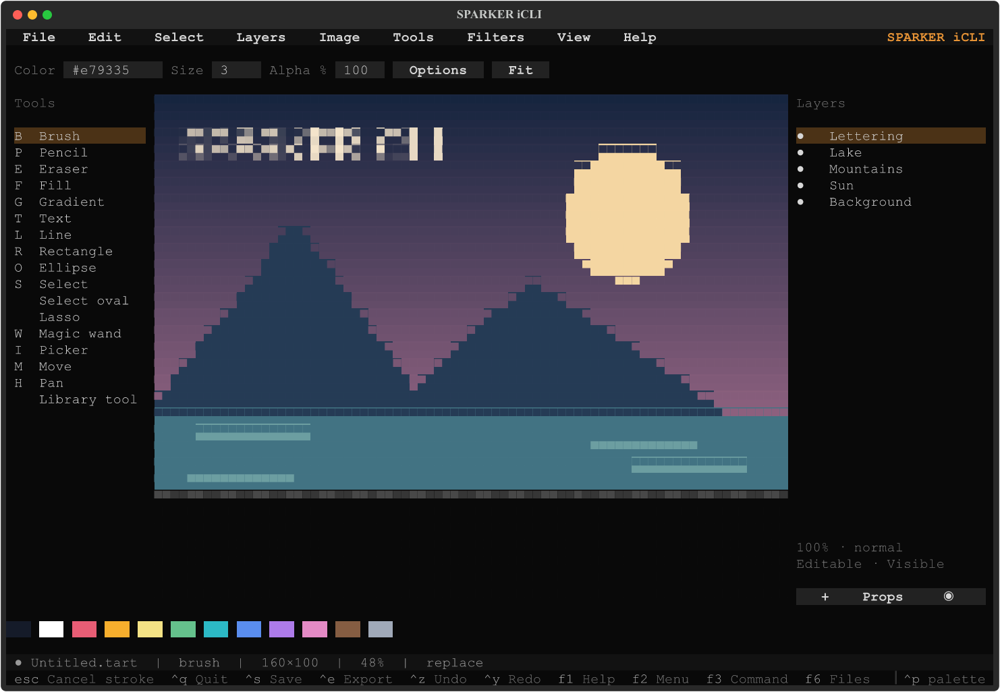

# SPARKER iCLI


Ever had the need to have MS paint in your command prompt? No? Download it anyway!

SPARKER iCLI is a minimalist terminal image editor for mouse painting and digital
pixel art, with a full-screen command workspace and **1,248 procedural art recipes
and effects**. Paint interactively or use repeatable commands and scripts against
the same layered RGBA document.



## Run on Windows

Install **Python 3.11 or later** and open this folder in Windows Terminal.
Double-click **run.cmd**, or run:

```powershell
.\run.ps1
```

The first launch prepares an isolated environment and downloads dependencies.
Subsequent launches reuse it. Use a true-color, Unicode terminal with a monospaced
font; 120 columns by 40 rows is a useful starting size.

```powershell
.\run.ps1 --demo
.\run.ps1 --cli
.\run.ps1 --new 1024x768 --no-debug
```

The Windows launchers include a borderless logo loading screen and a configurable
debug overlay. `--no-debug` hides the overlay; `debug off` in the command workspace
turns it off while editing.

## What it does

- Brush, pencil, eraser, fills, gradients, text and geometric shapes; mouse drag,
  zoom and pan with continuous thin-stroke previews at Fit.
- Layers, masks, opacity and blend modes; selections, transforms, filters,
  palettes, guides and a grid, with shared undo/redo.
- A searchable library of 600 stamps, 200 textured brushes, 400 patterns and
  48 image effects. Color, size and angle settings are separate from that count.
- **F3** opens the full-screen CLI and detached live painting preview;
  **F5** opens the tool library; **F6** opens the shared file explorer.
- Editable **.tart** projects preserve layers, masks and metadata. PNG, TIFF and
  WebP exports preserve original dimensions and RGBA pixels. ASCII and ANSI
  exports produce text representations. JPEG/GIF/BMP require explicit lossy opt-in.

Exports default to **Pictures\SPARKER-iCLI\Exports**, outside the application
folder. Display zoom and terminal character resolution do not resize saved images.

## Documentation

- [Complete usage and shortcuts](USAGE.md)
- [Command reference](COMMANDS.md)
- [Art tool catalog](TOOLS.md)
- [Native project format](FORMAT.md)
- [Verification](TESTING.md) and [performance measurements](PERFORMANCE.md)
- [Contributing and local checks](CONTRIBUTING.md)
- [Creating your GitHub repository](PUBLISHING.md)
- [Changes](CHANGELOG.md)

Application code lives in **src/** and tests in **tests/**. The internal
`termatelier` package name and .tart identifier are retained for compatibility;
the public commands are `sparker` and `sparkericli`.

## Install with Python

From the repository root:

```powershell
py -3 -m venv .venv
.\.venv\Scripts\python.exe -m pip install -e .
.\.venv\Scripts\python.exe -m sparkericli
```

On Linux/macOS, use `python3 -m venv .venv`, then
`.venv/bin/python -m pip install -e .` and
`.venv/bin/python -m sparkericli`. Native windows require Tk; terminal painting
and plain command editing remain usable without it. The Windows logo/debug
integration is specific to the Windows launchers.

## Scope and license

This is a raster editor. Vector paths, editable text objects, tablet pressure,
animation timelines, CMYK/ICC workflows and layered PSD/XCF import are absent.
See the detailed usage guide for document and history limits.

Built with Textual and Pillow. Released under the existing [MIT license](LICENSE).
