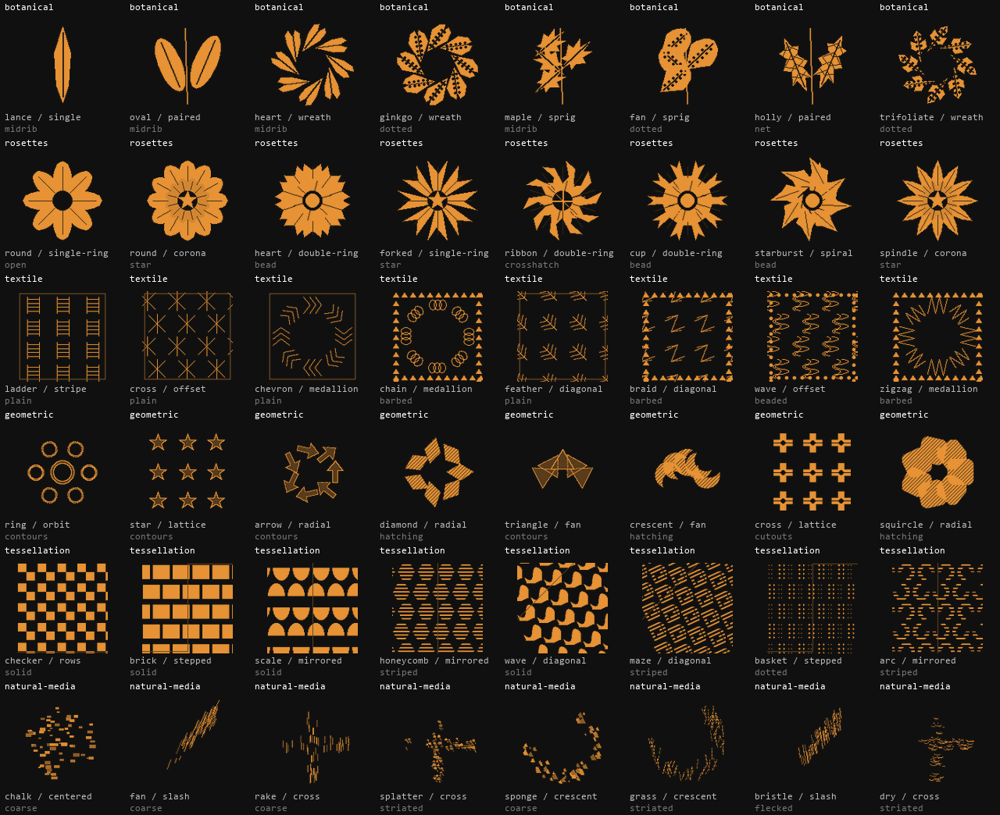

# SPARKER iCLI art tool reference

The live registry contains **1,248 executable entries**: 600 stamps, 200 textured brushes,
400 patterns and 48 image effects. Every ID below can be used from the mouse library
or command workspace. All 1,200 drawable recipes have distinct rendered footprints.

Press **F5 in the painter** to browse/search visual previews, or use:

```text
tools search "oak wreath"
tools count
tools info botanical.oak.wreath.net
tool botanical.oak.wreath.net
tool-options --size 48 --angle 20 --seed 7
apply botanical.oak.wreath.net 64,48 --color orange
```

Apply options include points, inclusive `--box x0,y0,x1,y1`, size, color, background,
opacity, rotation, density, seed and effect amount. Read COMMANDS.md for complete syntax.
Stamps mark points; textured brushes interpolate strokes; patterns repeat inside a box
or the canvas; effects process the active layer. Pixel edits obey selection/layer locks
and participate in shared undo. Tool IDs/options are preserved in native projects.

The catalog counts procedural art recipes and image operations. Changing color, size,
angle or strength leaves the catalog count unchanged. The classic drawing/selection
and layer commands remain available in addition to these entries.



## Botanical · 200

Leaf silhouettes with different growth arrangements and vein structures.

| ID | Name | Type |
| --- | --- | --- |
| `botanical.lance.single.midrib` | Lance / single / midrib | stamp |
| `botanical.lance.single.herringbone` | Lance / single / herringbone | stamp |
| `botanical.lance.single.net` | Lance / single / net | stamp |
| `botanical.lance.single.dotted` | Lance / single / dotted | stamp |
| `botanical.lance.paired.midrib` | Lance / paired / midrib | stamp |
| `botanical.lance.paired.herringbone` | Lance / paired / herringbone | stamp |
| `botanical.lance.paired.net` | Lance / paired / net | stamp |
| `botanical.lance.paired.dotted` | Lance / paired / dotted | stamp |
| `botanical.lance.sprig.midrib` | Lance / sprig / midrib | stamp |
| `botanical.lance.sprig.herringbone` | Lance / sprig / herringbone | stamp |
| `botanical.lance.sprig.net` | Lance / sprig / net | stamp |
| `botanical.lance.sprig.dotted` | Lance / sprig / dotted | stamp |
| `botanical.lance.whorl.midrib` | Lance / whorl / midrib | stamp |
| `botanical.lance.whorl.herringbone` | Lance / whorl / herringbone | stamp |
| `botanical.lance.whorl.net` | Lance / whorl / net | stamp |
| `botanical.lance.whorl.dotted` | Lance / whorl / dotted | stamp |
| `botanical.lance.wreath.midrib` | Lance / wreath / midrib | stamp |
| `botanical.lance.wreath.herringbone` | Lance / wreath / herringbone | stamp |
| `botanical.lance.wreath.net` | Lance / wreath / net | stamp |
| `botanical.lance.wreath.dotted` | Lance / wreath / dotted | stamp |
| `botanical.oval.single.midrib` | Oval / single / midrib | stamp |
| `botanical.oval.single.herringbone` | Oval / single / herringbone | stamp |
| `botanical.oval.single.net` | Oval / single / net | stamp |
| `botanical.oval.single.dotted` | Oval / single / dotted | stamp |
| `botanical.oval.paired.midrib` | Oval / paired / midrib | stamp |
| `botanical.oval.paired.herringbone` | Oval / paired / herringbone | stamp |
| `botanical.oval.paired.net` | Oval / paired / net | stamp |
| `botanical.oval.paired.dotted` | Oval / paired / dotted | stamp |
| `botanical.oval.sprig.midrib` | Oval / sprig / midrib | stamp |
| `botanical.oval.sprig.herringbone` | Oval / sprig / herringbone | stamp |
| `botanical.oval.sprig.net` | Oval / sprig / net | stamp |
| `botanical.oval.sprig.dotted` | Oval / sprig / dotted | stamp |
| `botanical.oval.whorl.midrib` | Oval / whorl / midrib | stamp |
| `botanical.oval.whorl.herringbone` | Oval / whorl / herringbone | stamp |
| `botanical.oval.whorl.net` | Oval / whorl / net | stamp |
| `botanical.oval.whorl.dotted` | Oval / whorl / dotted | stamp |
| `botanical.oval.wreath.midrib` | Oval / wreath / midrib | stamp |
| `botanical.oval.wreath.herringbone` | Oval / wreath / herringbone | stamp |
| `botanical.oval.wreath.net` | Oval / wreath / net | stamp |
| `botanical.oval.wreath.dotted` | Oval / wreath / dotted | stamp |
| `botanical.heart.single.midrib` | Heart / single / midrib | stamp |
| `botanical.heart.single.herringbone` | Heart / single / herringbone | stamp |
| `botanical.heart.single.net` | Heart / single / net | stamp |
| `botanical.heart.single.dotted` | Heart / single / dotted | stamp |
| `botanical.heart.paired.midrib` | Heart / paired / midrib | stamp |
| `botanical.heart.paired.herringbone` | Heart / paired / herringbone | stamp |
| `botanical.heart.paired.net` | Heart / paired / net | stamp |
| `botanical.heart.paired.dotted` | Heart / paired / dotted | stamp |
| `botanical.heart.sprig.midrib` | Heart / sprig / midrib | stamp |
| `botanical.heart.sprig.herringbone` | Heart / sprig / herringbone | stamp |
| `botanical.heart.sprig.net` | Heart / sprig / net | stamp |
| `botanical.heart.sprig.dotted` | Heart / sprig / dotted | stamp |
| `botanical.heart.whorl.midrib` | Heart / whorl / midrib | stamp |
| `botanical.heart.whorl.herringbone` | Heart / whorl / herringbone | stamp |
| `botanical.heart.whorl.net` | Heart / whorl / net | stamp |
| `botanical.heart.whorl.dotted` | Heart / whorl / dotted | stamp |
| `botanical.heart.wreath.midrib` | Heart / wreath / midrib | stamp |
| `botanical.heart.wreath.herringbone` | Heart / wreath / herringbone | stamp |
| `botanical.heart.wreath.net` | Heart / wreath / net | stamp |
| `botanical.heart.wreath.dotted` | Heart / wreath / dotted | stamp |
| `botanical.ginkgo.single.midrib` | Ginkgo / single / midrib | stamp |
| `botanical.ginkgo.single.herringbone` | Ginkgo / single / herringbone | stamp |
| `botanical.ginkgo.single.net` | Ginkgo / single / net | stamp |
| `botanical.ginkgo.single.dotted` | Ginkgo / single / dotted | stamp |
| `botanical.ginkgo.paired.midrib` | Ginkgo / paired / midrib | stamp |
| `botanical.ginkgo.paired.herringbone` | Ginkgo / paired / herringbone | stamp |
| `botanical.ginkgo.paired.net` | Ginkgo / paired / net | stamp |
| `botanical.ginkgo.paired.dotted` | Ginkgo / paired / dotted | stamp |
| `botanical.ginkgo.sprig.midrib` | Ginkgo / sprig / midrib | stamp |
| `botanical.ginkgo.sprig.herringbone` | Ginkgo / sprig / herringbone | stamp |
| `botanical.ginkgo.sprig.net` | Ginkgo / sprig / net | stamp |
| `botanical.ginkgo.sprig.dotted` | Ginkgo / sprig / dotted | stamp |
| `botanical.ginkgo.whorl.midrib` | Ginkgo / whorl / midrib | stamp |
| `botanical.ginkgo.whorl.herringbone` | Ginkgo / whorl / herringbone | stamp |
| `botanical.ginkgo.whorl.net` | Ginkgo / whorl / net | stamp |
| `botanical.ginkgo.whorl.dotted` | Ginkgo / whorl / dotted | stamp |
| `botanical.ginkgo.wreath.midrib` | Ginkgo / wreath / midrib | stamp |
| `botanical.ginkgo.wreath.herringbone` | Ginkgo / wreath / herringbone | stamp |
| `botanical.ginkgo.wreath.net` | Ginkgo / wreath / net | stamp |
| `botanical.ginkgo.wreath.dotted` | Ginkgo / wreath / dotted | stamp |
| `botanical.oak.single.midrib` | Oak / single / midrib | stamp |
| `botanical.oak.single.herringbone` | Oak / single / herringbone | stamp |
| `botanical.oak.single.net` | Oak / single / net | stamp |
| `botanical.oak.single.dotted` | Oak / single / dotted | stamp |
| `botanical.oak.paired.midrib` | Oak / paired / midrib | stamp |
| `botanical.oak.paired.herringbone` | Oak / paired / herringbone | stamp |
| `botanical.oak.paired.net` | Oak / paired / net | stamp |
| `botanical.oak.paired.dotted` | Oak / paired / dotted | stamp |
| `botanical.oak.sprig.midrib` | Oak / sprig / midrib | stamp |
| `botanical.oak.sprig.herringbone` | Oak / sprig / herringbone | stamp |
| `botanical.oak.sprig.net` | Oak / sprig / net | stamp |
| `botanical.oak.sprig.dotted` | Oak / sprig / dotted | stamp |
| `botanical.oak.whorl.midrib` | Oak / whorl / midrib | stamp |
| `botanical.oak.whorl.herringbone` | Oak / whorl / herringbone | stamp |
| `botanical.oak.whorl.net` | Oak / whorl / net | stamp |
| `botanical.oak.whorl.dotted` | Oak / whorl / dotted | stamp |
| `botanical.oak.wreath.midrib` | Oak / wreath / midrib | stamp |
| `botanical.oak.wreath.herringbone` | Oak / wreath / herringbone | stamp |
| `botanical.oak.wreath.net` | Oak / wreath / net | stamp |
| `botanical.oak.wreath.dotted` | Oak / wreath / dotted | stamp |
| `botanical.maple.single.midrib` | Maple / single / midrib | stamp |
| `botanical.maple.single.herringbone` | Maple / single / herringbone | stamp |
| `botanical.maple.single.net` | Maple / single / net | stamp |
| `botanical.maple.single.dotted` | Maple / single / dotted | stamp |
| `botanical.maple.paired.midrib` | Maple / paired / midrib | stamp |
| `botanical.maple.paired.herringbone` | Maple / paired / herringbone | stamp |
| `botanical.maple.paired.net` | Maple / paired / net | stamp |
| `botanical.maple.paired.dotted` | Maple / paired / dotted | stamp |
| `botanical.maple.sprig.midrib` | Maple / sprig / midrib | stamp |
| `botanical.maple.sprig.herringbone` | Maple / sprig / herringbone | stamp |
| `botanical.maple.sprig.net` | Maple / sprig / net | stamp |
| `botanical.maple.sprig.dotted` | Maple / sprig / dotted | stamp |
| `botanical.maple.whorl.midrib` | Maple / whorl / midrib | stamp |
| `botanical.maple.whorl.herringbone` | Maple / whorl / herringbone | stamp |
| `botanical.maple.whorl.net` | Maple / whorl / net | stamp |
| `botanical.maple.whorl.dotted` | Maple / whorl / dotted | stamp |
| `botanical.maple.wreath.midrib` | Maple / wreath / midrib | stamp |
| `botanical.maple.wreath.herringbone` | Maple / wreath / herringbone | stamp |
| `botanical.maple.wreath.net` | Maple / wreath / net | stamp |
| `botanical.maple.wreath.dotted` | Maple / wreath / dotted | stamp |
| `botanical.fan.single.midrib` | Fan / single / midrib | stamp |
| `botanical.fan.single.herringbone` | Fan / single / herringbone | stamp |
| `botanical.fan.single.net` | Fan / single / net | stamp |
| `botanical.fan.single.dotted` | Fan / single / dotted | stamp |
| `botanical.fan.paired.midrib` | Fan / paired / midrib | stamp |
| `botanical.fan.paired.herringbone` | Fan / paired / herringbone | stamp |
| `botanical.fan.paired.net` | Fan / paired / net | stamp |
| `botanical.fan.paired.dotted` | Fan / paired / dotted | stamp |
| `botanical.fan.sprig.midrib` | Fan / sprig / midrib | stamp |
| `botanical.fan.sprig.herringbone` | Fan / sprig / herringbone | stamp |
| `botanical.fan.sprig.net` | Fan / sprig / net | stamp |
| `botanical.fan.sprig.dotted` | Fan / sprig / dotted | stamp |
| `botanical.fan.whorl.midrib` | Fan / whorl / midrib | stamp |
| `botanical.fan.whorl.herringbone` | Fan / whorl / herringbone | stamp |
| `botanical.fan.whorl.net` | Fan / whorl / net | stamp |
| `botanical.fan.whorl.dotted` | Fan / whorl / dotted | stamp |
| `botanical.fan.wreath.midrib` | Fan / wreath / midrib | stamp |
| `botanical.fan.wreath.herringbone` | Fan / wreath / herringbone | stamp |
| `botanical.fan.wreath.net` | Fan / wreath / net | stamp |
| `botanical.fan.wreath.dotted` | Fan / wreath / dotted | stamp |
| `botanical.arrow.single.midrib` | Arrow / single / midrib | stamp |
| `botanical.arrow.single.herringbone` | Arrow / single / herringbone | stamp |
| `botanical.arrow.single.net` | Arrow / single / net | stamp |
| `botanical.arrow.single.dotted` | Arrow / single / dotted | stamp |
| `botanical.arrow.paired.midrib` | Arrow / paired / midrib | stamp |
| `botanical.arrow.paired.herringbone` | Arrow / paired / herringbone | stamp |
| `botanical.arrow.paired.net` | Arrow / paired / net | stamp |
| `botanical.arrow.paired.dotted` | Arrow / paired / dotted | stamp |
| `botanical.arrow.sprig.midrib` | Arrow / sprig / midrib | stamp |
| `botanical.arrow.sprig.herringbone` | Arrow / sprig / herringbone | stamp |
| `botanical.arrow.sprig.net` | Arrow / sprig / net | stamp |
| `botanical.arrow.sprig.dotted` | Arrow / sprig / dotted | stamp |
| `botanical.arrow.whorl.midrib` | Arrow / whorl / midrib | stamp |
| `botanical.arrow.whorl.herringbone` | Arrow / whorl / herringbone | stamp |
| `botanical.arrow.whorl.net` | Arrow / whorl / net | stamp |
| `botanical.arrow.whorl.dotted` | Arrow / whorl / dotted | stamp |
| `botanical.arrow.wreath.midrib` | Arrow / wreath / midrib | stamp |
| `botanical.arrow.wreath.herringbone` | Arrow / wreath / herringbone | stamp |
| `botanical.arrow.wreath.net` | Arrow / wreath / net | stamp |
| `botanical.arrow.wreath.dotted` | Arrow / wreath / dotted | stamp |
| `botanical.holly.single.midrib` | Holly / single / midrib | stamp |
| `botanical.holly.single.herringbone` | Holly / single / herringbone | stamp |
| `botanical.holly.single.net` | Holly / single / net | stamp |
| `botanical.holly.single.dotted` | Holly / single / dotted | stamp |
| `botanical.holly.paired.midrib` | Holly / paired / midrib | stamp |
| `botanical.holly.paired.herringbone` | Holly / paired / herringbone | stamp |
| `botanical.holly.paired.net` | Holly / paired / net | stamp |
| `botanical.holly.paired.dotted` | Holly / paired / dotted | stamp |
| `botanical.holly.sprig.midrib` | Holly / sprig / midrib | stamp |
| `botanical.holly.sprig.herringbone` | Holly / sprig / herringbone | stamp |
| `botanical.holly.sprig.net` | Holly / sprig / net | stamp |
| `botanical.holly.sprig.dotted` | Holly / sprig / dotted | stamp |
| `botanical.holly.whorl.midrib` | Holly / whorl / midrib | stamp |
| `botanical.holly.whorl.herringbone` | Holly / whorl / herringbone | stamp |
| `botanical.holly.whorl.net` | Holly / whorl / net | stamp |
| `botanical.holly.whorl.dotted` | Holly / whorl / dotted | stamp |
| `botanical.holly.wreath.midrib` | Holly / wreath / midrib | stamp |
| `botanical.holly.wreath.herringbone` | Holly / wreath / herringbone | stamp |
| `botanical.holly.wreath.net` | Holly / wreath / net | stamp |
| `botanical.holly.wreath.dotted` | Holly / wreath / dotted | stamp |
| `botanical.trifoliate.single.midrib` | Trifoliate / single / midrib | stamp |
| `botanical.trifoliate.single.herringbone` | Trifoliate / single / herringbone | stamp |
| `botanical.trifoliate.single.net` | Trifoliate / single / net | stamp |
| `botanical.trifoliate.single.dotted` | Trifoliate / single / dotted | stamp |
| `botanical.trifoliate.paired.midrib` | Trifoliate / paired / midrib | stamp |
| `botanical.trifoliate.paired.herringbone` | Trifoliate / paired / herringbone | stamp |
| `botanical.trifoliate.paired.net` | Trifoliate / paired / net | stamp |
| `botanical.trifoliate.paired.dotted` | Trifoliate / paired / dotted | stamp |
| `botanical.trifoliate.sprig.midrib` | Trifoliate / sprig / midrib | stamp |
| `botanical.trifoliate.sprig.herringbone` | Trifoliate / sprig / herringbone | stamp |
| `botanical.trifoliate.sprig.net` | Trifoliate / sprig / net | stamp |
| `botanical.trifoliate.sprig.dotted` | Trifoliate / sprig / dotted | stamp |
| `botanical.trifoliate.whorl.midrib` | Trifoliate / whorl / midrib | stamp |
| `botanical.trifoliate.whorl.herringbone` | Trifoliate / whorl / herringbone | stamp |
| `botanical.trifoliate.whorl.net` | Trifoliate / whorl / net | stamp |
| `botanical.trifoliate.whorl.dotted` | Trifoliate / whorl / dotted | stamp |
| `botanical.trifoliate.wreath.midrib` | Trifoliate / wreath / midrib | stamp |
| `botanical.trifoliate.wreath.herringbone` | Trifoliate / wreath / herringbone | stamp |
| `botanical.trifoliate.wreath.net` | Trifoliate / wreath / net | stamp |
| `botanical.trifoliate.wreath.dotted` | Trifoliate / wreath / dotted | stamp |

## Rosettes · 200

Floral ornaments with distinct petals, ring constructions and centers.

| ID | Name | Type |
| --- | --- | --- |
| `rosettes.round.single-ring.open` | Round / single ring / open | stamp |
| `rosettes.round.single-ring.bead` | Round / single ring / bead | stamp |
| `rosettes.round.single-ring.seedwheel` | Round / single ring / seedwheel | stamp |
| `rosettes.round.single-ring.crosshatch` | Round / single ring / crosshatch | stamp |
| `rosettes.round.single-ring.star` | Round / single ring / star | stamp |
| `rosettes.round.double-ring.open` | Round / double ring / open | stamp |
| `rosettes.round.double-ring.bead` | Round / double ring / bead | stamp |
| `rosettes.round.double-ring.seedwheel` | Round / double ring / seedwheel | stamp |
| `rosettes.round.double-ring.crosshatch` | Round / double ring / crosshatch | stamp |
| `rosettes.round.double-ring.star` | Round / double ring / star | stamp |
| `rosettes.round.alternating.open` | Round / alternating / open | stamp |
| `rosettes.round.alternating.bead` | Round / alternating / bead | stamp |
| `rosettes.round.alternating.seedwheel` | Round / alternating / seedwheel | stamp |
| `rosettes.round.alternating.crosshatch` | Round / alternating / crosshatch | stamp |
| `rosettes.round.alternating.star` | Round / alternating / star | stamp |
| `rosettes.round.spiral.open` | Round / spiral / open | stamp |
| `rosettes.round.spiral.bead` | Round / spiral / bead | stamp |
| `rosettes.round.spiral.seedwheel` | Round / spiral / seedwheel | stamp |
| `rosettes.round.spiral.crosshatch` | Round / spiral / crosshatch | stamp |
| `rosettes.round.spiral.star` | Round / spiral / star | stamp |
| `rosettes.round.corona.open` | Round / corona / open | stamp |
| `rosettes.round.corona.bead` | Round / corona / bead | stamp |
| `rosettes.round.corona.seedwheel` | Round / corona / seedwheel | stamp |
| `rosettes.round.corona.crosshatch` | Round / corona / crosshatch | stamp |
| `rosettes.round.corona.star` | Round / corona / star | stamp |
| `rosettes.spear.single-ring.open` | Spear / single ring / open | stamp |
| `rosettes.spear.single-ring.bead` | Spear / single ring / bead | stamp |
| `rosettes.spear.single-ring.seedwheel` | Spear / single ring / seedwheel | stamp |
| `rosettes.spear.single-ring.crosshatch` | Spear / single ring / crosshatch | stamp |
| `rosettes.spear.single-ring.star` | Spear / single ring / star | stamp |
| `rosettes.spear.double-ring.open` | Spear / double ring / open | stamp |
| `rosettes.spear.double-ring.bead` | Spear / double ring / bead | stamp |
| `rosettes.spear.double-ring.seedwheel` | Spear / double ring / seedwheel | stamp |
| `rosettes.spear.double-ring.crosshatch` | Spear / double ring / crosshatch | stamp |
| `rosettes.spear.double-ring.star` | Spear / double ring / star | stamp |
| `rosettes.spear.alternating.open` | Spear / alternating / open | stamp |
| `rosettes.spear.alternating.bead` | Spear / alternating / bead | stamp |
| `rosettes.spear.alternating.seedwheel` | Spear / alternating / seedwheel | stamp |
| `rosettes.spear.alternating.crosshatch` | Spear / alternating / crosshatch | stamp |
| `rosettes.spear.alternating.star` | Spear / alternating / star | stamp |
| `rosettes.spear.spiral.open` | Spear / spiral / open | stamp |
| `rosettes.spear.spiral.bead` | Spear / spiral / bead | stamp |
| `rosettes.spear.spiral.seedwheel` | Spear / spiral / seedwheel | stamp |
| `rosettes.spear.spiral.crosshatch` | Spear / spiral / crosshatch | stamp |
| `rosettes.spear.spiral.star` | Spear / spiral / star | stamp |
| `rosettes.spear.corona.open` | Spear / corona / open | stamp |
| `rosettes.spear.corona.bead` | Spear / corona / bead | stamp |
| `rosettes.spear.corona.seedwheel` | Spear / corona / seedwheel | stamp |
| `rosettes.spear.corona.crosshatch` | Spear / corona / crosshatch | stamp |
| `rosettes.spear.corona.star` | Spear / corona / star | stamp |
| `rosettes.heart.single-ring.open` | Heart / single ring / open | stamp |
| `rosettes.heart.single-ring.bead` | Heart / single ring / bead | stamp |
| `rosettes.heart.single-ring.seedwheel` | Heart / single ring / seedwheel | stamp |
| `rosettes.heart.single-ring.crosshatch` | Heart / single ring / crosshatch | stamp |
| `rosettes.heart.single-ring.star` | Heart / single ring / star | stamp |
| `rosettes.heart.double-ring.open` | Heart / double ring / open | stamp |
| `rosettes.heart.double-ring.bead` | Heart / double ring / bead | stamp |
| `rosettes.heart.double-ring.seedwheel` | Heart / double ring / seedwheel | stamp |
| `rosettes.heart.double-ring.crosshatch` | Heart / double ring / crosshatch | stamp |
| `rosettes.heart.double-ring.star` | Heart / double ring / star | stamp |
| `rosettes.heart.alternating.open` | Heart / alternating / open | stamp |
| `rosettes.heart.alternating.bead` | Heart / alternating / bead | stamp |
| `rosettes.heart.alternating.seedwheel` | Heart / alternating / seedwheel | stamp |
| `rosettes.heart.alternating.crosshatch` | Heart / alternating / crosshatch | stamp |
| `rosettes.heart.alternating.star` | Heart / alternating / star | stamp |
| `rosettes.heart.spiral.open` | Heart / spiral / open | stamp |
| `rosettes.heart.spiral.bead` | Heart / spiral / bead | stamp |
| `rosettes.heart.spiral.seedwheel` | Heart / spiral / seedwheel | stamp |
| `rosettes.heart.spiral.crosshatch` | Heart / spiral / crosshatch | stamp |
| `rosettes.heart.spiral.star` | Heart / spiral / star | stamp |
| `rosettes.heart.corona.open` | Heart / corona / open | stamp |
| `rosettes.heart.corona.bead` | Heart / corona / bead | stamp |
| `rosettes.heart.corona.seedwheel` | Heart / corona / seedwheel | stamp |
| `rosettes.heart.corona.crosshatch` | Heart / corona / crosshatch | stamp |
| `rosettes.heart.corona.star` | Heart / corona / star | stamp |
| `rosettes.forked.single-ring.open` | Forked / single ring / open | stamp |
| `rosettes.forked.single-ring.bead` | Forked / single ring / bead | stamp |
| `rosettes.forked.single-ring.seedwheel` | Forked / single ring / seedwheel | stamp |
| `rosettes.forked.single-ring.crosshatch` | Forked / single ring / crosshatch | stamp |
| `rosettes.forked.single-ring.star` | Forked / single ring / star | stamp |
| `rosettes.forked.double-ring.open` | Forked / double ring / open | stamp |
| `rosettes.forked.double-ring.bead` | Forked / double ring / bead | stamp |
| `rosettes.forked.double-ring.seedwheel` | Forked / double ring / seedwheel | stamp |
| `rosettes.forked.double-ring.crosshatch` | Forked / double ring / crosshatch | stamp |
| `rosettes.forked.double-ring.star` | Forked / double ring / star | stamp |
| `rosettes.forked.alternating.open` | Forked / alternating / open | stamp |
| `rosettes.forked.alternating.bead` | Forked / alternating / bead | stamp |
| `rosettes.forked.alternating.seedwheel` | Forked / alternating / seedwheel | stamp |
| `rosettes.forked.alternating.crosshatch` | Forked / alternating / crosshatch | stamp |
| `rosettes.forked.alternating.star` | Forked / alternating / star | stamp |
| `rosettes.forked.spiral.open` | Forked / spiral / open | stamp |
| `rosettes.forked.spiral.bead` | Forked / spiral / bead | stamp |
| `rosettes.forked.spiral.seedwheel` | Forked / spiral / seedwheel | stamp |
| `rosettes.forked.spiral.crosshatch` | Forked / spiral / crosshatch | stamp |
| `rosettes.forked.spiral.star` | Forked / spiral / star | stamp |
| `rosettes.forked.corona.open` | Forked / corona / open | stamp |
| `rosettes.forked.corona.bead` | Forked / corona / bead | stamp |
| `rosettes.forked.corona.seedwheel` | Forked / corona / seedwheel | stamp |
| `rosettes.forked.corona.crosshatch` | Forked / corona / crosshatch | stamp |
| `rosettes.forked.corona.star` | Forked / corona / star | stamp |
| `rosettes.ribbon.single-ring.open` | Ribbon / single ring / open | stamp |
| `rosettes.ribbon.single-ring.bead` | Ribbon / single ring / bead | stamp |
| `rosettes.ribbon.single-ring.seedwheel` | Ribbon / single ring / seedwheel | stamp |
| `rosettes.ribbon.single-ring.crosshatch` | Ribbon / single ring / crosshatch | stamp |
| `rosettes.ribbon.single-ring.star` | Ribbon / single ring / star | stamp |
| `rosettes.ribbon.double-ring.open` | Ribbon / double ring / open | stamp |
| `rosettes.ribbon.double-ring.bead` | Ribbon / double ring / bead | stamp |
| `rosettes.ribbon.double-ring.seedwheel` | Ribbon / double ring / seedwheel | stamp |
| `rosettes.ribbon.double-ring.crosshatch` | Ribbon / double ring / crosshatch | stamp |
| `rosettes.ribbon.double-ring.star` | Ribbon / double ring / star | stamp |
| `rosettes.ribbon.alternating.open` | Ribbon / alternating / open | stamp |
| `rosettes.ribbon.alternating.bead` | Ribbon / alternating / bead | stamp |
| `rosettes.ribbon.alternating.seedwheel` | Ribbon / alternating / seedwheel | stamp |
| `rosettes.ribbon.alternating.crosshatch` | Ribbon / alternating / crosshatch | stamp |
| `rosettes.ribbon.alternating.star` | Ribbon / alternating / star | stamp |
| `rosettes.ribbon.spiral.open` | Ribbon / spiral / open | stamp |
| `rosettes.ribbon.spiral.bead` | Ribbon / spiral / bead | stamp |
| `rosettes.ribbon.spiral.seedwheel` | Ribbon / spiral / seedwheel | stamp |
| `rosettes.ribbon.spiral.crosshatch` | Ribbon / spiral / crosshatch | stamp |
| `rosettes.ribbon.spiral.star` | Ribbon / spiral / star | stamp |
| `rosettes.ribbon.corona.open` | Ribbon / corona / open | stamp |
| `rosettes.ribbon.corona.bead` | Ribbon / corona / bead | stamp |
| `rosettes.ribbon.corona.seedwheel` | Ribbon / corona / seedwheel | stamp |
| `rosettes.ribbon.corona.crosshatch` | Ribbon / corona / crosshatch | stamp |
| `rosettes.ribbon.corona.star` | Ribbon / corona / star | stamp |
| `rosettes.cup.single-ring.open` | Cup / single ring / open | stamp |
| `rosettes.cup.single-ring.bead` | Cup / single ring / bead | stamp |
| `rosettes.cup.single-ring.seedwheel` | Cup / single ring / seedwheel | stamp |
| `rosettes.cup.single-ring.crosshatch` | Cup / single ring / crosshatch | stamp |
| `rosettes.cup.single-ring.star` | Cup / single ring / star | stamp |
| `rosettes.cup.double-ring.open` | Cup / double ring / open | stamp |
| `rosettes.cup.double-ring.bead` | Cup / double ring / bead | stamp |
| `rosettes.cup.double-ring.seedwheel` | Cup / double ring / seedwheel | stamp |
| `rosettes.cup.double-ring.crosshatch` | Cup / double ring / crosshatch | stamp |
| `rosettes.cup.double-ring.star` | Cup / double ring / star | stamp |
| `rosettes.cup.alternating.open` | Cup / alternating / open | stamp |
| `rosettes.cup.alternating.bead` | Cup / alternating / bead | stamp |
| `rosettes.cup.alternating.seedwheel` | Cup / alternating / seedwheel | stamp |
| `rosettes.cup.alternating.crosshatch` | Cup / alternating / crosshatch | stamp |
| `rosettes.cup.alternating.star` | Cup / alternating / star | stamp |
| `rosettes.cup.spiral.open` | Cup / spiral / open | stamp |
| `rosettes.cup.spiral.bead` | Cup / spiral / bead | stamp |
| `rosettes.cup.spiral.seedwheel` | Cup / spiral / seedwheel | stamp |
| `rosettes.cup.spiral.crosshatch` | Cup / spiral / crosshatch | stamp |
| `rosettes.cup.spiral.star` | Cup / spiral / star | stamp |
| `rosettes.cup.corona.open` | Cup / corona / open | stamp |
| `rosettes.cup.corona.bead` | Cup / corona / bead | stamp |
| `rosettes.cup.corona.seedwheel` | Cup / corona / seedwheel | stamp |
| `rosettes.cup.corona.crosshatch` | Cup / corona / crosshatch | stamp |
| `rosettes.cup.corona.star` | Cup / corona / star | stamp |
| `rosettes.starburst.single-ring.open` | Starburst / single ring / open | stamp |
| `rosettes.starburst.single-ring.bead` | Starburst / single ring / bead | stamp |
| `rosettes.starburst.single-ring.seedwheel` | Starburst / single ring / seedwheel | stamp |
| `rosettes.starburst.single-ring.crosshatch` | Starburst / single ring / crosshatch | stamp |
| `rosettes.starburst.single-ring.star` | Starburst / single ring / star | stamp |
| `rosettes.starburst.double-ring.open` | Starburst / double ring / open | stamp |
| `rosettes.starburst.double-ring.bead` | Starburst / double ring / bead | stamp |
| `rosettes.starburst.double-ring.seedwheel` | Starburst / double ring / seedwheel | stamp |
| `rosettes.starburst.double-ring.crosshatch` | Starburst / double ring / crosshatch | stamp |
| `rosettes.starburst.double-ring.star` | Starburst / double ring / star | stamp |
| `rosettes.starburst.alternating.open` | Starburst / alternating / open | stamp |
| `rosettes.starburst.alternating.bead` | Starburst / alternating / bead | stamp |
| `rosettes.starburst.alternating.seedwheel` | Starburst / alternating / seedwheel | stamp |
| `rosettes.starburst.alternating.crosshatch` | Starburst / alternating / crosshatch | stamp |
| `rosettes.starburst.alternating.star` | Starburst / alternating / star | stamp |
| `rosettes.starburst.spiral.open` | Starburst / spiral / open | stamp |
| `rosettes.starburst.spiral.bead` | Starburst / spiral / bead | stamp |
| `rosettes.starburst.spiral.seedwheel` | Starburst / spiral / seedwheel | stamp |
| `rosettes.starburst.spiral.crosshatch` | Starburst / spiral / crosshatch | stamp |
| `rosettes.starburst.spiral.star` | Starburst / spiral / star | stamp |
| `rosettes.starburst.corona.open` | Starburst / corona / open | stamp |
| `rosettes.starburst.corona.bead` | Starburst / corona / bead | stamp |
| `rosettes.starburst.corona.seedwheel` | Starburst / corona / seedwheel | stamp |
| `rosettes.starburst.corona.crosshatch` | Starburst / corona / crosshatch | stamp |
| `rosettes.starburst.corona.star` | Starburst / corona / star | stamp |
| `rosettes.spindle.single-ring.open` | Spindle / single ring / open | stamp |
| `rosettes.spindle.single-ring.bead` | Spindle / single ring / bead | stamp |
| `rosettes.spindle.single-ring.seedwheel` | Spindle / single ring / seedwheel | stamp |
| `rosettes.spindle.single-ring.crosshatch` | Spindle / single ring / crosshatch | stamp |
| `rosettes.spindle.single-ring.star` | Spindle / single ring / star | stamp |
| `rosettes.spindle.double-ring.open` | Spindle / double ring / open | stamp |
| `rosettes.spindle.double-ring.bead` | Spindle / double ring / bead | stamp |
| `rosettes.spindle.double-ring.seedwheel` | Spindle / double ring / seedwheel | stamp |
| `rosettes.spindle.double-ring.crosshatch` | Spindle / double ring / crosshatch | stamp |
| `rosettes.spindle.double-ring.star` | Spindle / double ring / star | stamp |
| `rosettes.spindle.alternating.open` | Spindle / alternating / open | stamp |
| `rosettes.spindle.alternating.bead` | Spindle / alternating / bead | stamp |
| `rosettes.spindle.alternating.seedwheel` | Spindle / alternating / seedwheel | stamp |
| `rosettes.spindle.alternating.crosshatch` | Spindle / alternating / crosshatch | stamp |
| `rosettes.spindle.alternating.star` | Spindle / alternating / star | stamp |
| `rosettes.spindle.spiral.open` | Spindle / spiral / open | stamp |
| `rosettes.spindle.spiral.bead` | Spindle / spiral / bead | stamp |
| `rosettes.spindle.spiral.seedwheel` | Spindle / spiral / seedwheel | stamp |
| `rosettes.spindle.spiral.crosshatch` | Spindle / spiral / crosshatch | stamp |
| `rosettes.spindle.spiral.star` | Spindle / spiral / star | stamp |
| `rosettes.spindle.corona.open` | Spindle / corona / open | stamp |
| `rosettes.spindle.corona.bead` | Spindle / corona / bead | stamp |
| `rosettes.spindle.corona.seedwheel` | Spindle / corona / seedwheel | stamp |
| `rosettes.spindle.corona.crosshatch` | Spindle / corona / crosshatch | stamp |
| `rosettes.spindle.corona.star` | Spindle / corona / star | stamp |

## Textile · 200

Stitch patterns with different paths, repeats and edge construction.

| ID | Name | Type |
| --- | --- | --- |
| `textile.ladder.stripe.plain` | Ladder / stripe / plain | pattern |
| `textile.ladder.stripe.knotted` | Ladder / stripe / knotted | pattern |
| `textile.ladder.stripe.beaded` | Ladder / stripe / beaded | pattern |
| `textile.ladder.stripe.barbed` | Ladder / stripe / barbed | pattern |
| `textile.ladder.offset.plain` | Ladder / offset / plain | pattern |
| `textile.ladder.offset.knotted` | Ladder / offset / knotted | pattern |
| `textile.ladder.offset.beaded` | Ladder / offset / beaded | pattern |
| `textile.ladder.offset.barbed` | Ladder / offset / barbed | pattern |
| `textile.ladder.diagonal.plain` | Ladder / diagonal / plain | pattern |
| `textile.ladder.diagonal.knotted` | Ladder / diagonal / knotted | pattern |
| `textile.ladder.diagonal.beaded` | Ladder / diagonal / beaded | pattern |
| `textile.ladder.diagonal.barbed` | Ladder / diagonal / barbed | pattern |
| `textile.ladder.woven.plain` | Ladder / woven / plain | pattern |
| `textile.ladder.woven.knotted` | Ladder / woven / knotted | pattern |
| `textile.ladder.woven.beaded` | Ladder / woven / beaded | pattern |
| `textile.ladder.woven.barbed` | Ladder / woven / barbed | pattern |
| `textile.ladder.medallion.plain` | Ladder / medallion / plain | pattern |
| `textile.ladder.medallion.knotted` | Ladder / medallion / knotted | pattern |
| `textile.ladder.medallion.beaded` | Ladder / medallion / beaded | pattern |
| `textile.ladder.medallion.barbed` | Ladder / medallion / barbed | pattern |
| `textile.cross.stripe.plain` | Cross / stripe / plain | pattern |
| `textile.cross.stripe.knotted` | Cross / stripe / knotted | pattern |
| `textile.cross.stripe.beaded` | Cross / stripe / beaded | pattern |
| `textile.cross.stripe.barbed` | Cross / stripe / barbed | pattern |
| `textile.cross.offset.plain` | Cross / offset / plain | pattern |
| `textile.cross.offset.knotted` | Cross / offset / knotted | pattern |
| `textile.cross.offset.beaded` | Cross / offset / beaded | pattern |
| `textile.cross.offset.barbed` | Cross / offset / barbed | pattern |
| `textile.cross.diagonal.plain` | Cross / diagonal / plain | pattern |
| `textile.cross.diagonal.knotted` | Cross / diagonal / knotted | pattern |
| `textile.cross.diagonal.beaded` | Cross / diagonal / beaded | pattern |
| `textile.cross.diagonal.barbed` | Cross / diagonal / barbed | pattern |
| `textile.cross.woven.plain` | Cross / woven / plain | pattern |
| `textile.cross.woven.knotted` | Cross / woven / knotted | pattern |
| `textile.cross.woven.beaded` | Cross / woven / beaded | pattern |
| `textile.cross.woven.barbed` | Cross / woven / barbed | pattern |
| `textile.cross.medallion.plain` | Cross / medallion / plain | pattern |
| `textile.cross.medallion.knotted` | Cross / medallion / knotted | pattern |
| `textile.cross.medallion.beaded` | Cross / medallion / beaded | pattern |
| `textile.cross.medallion.barbed` | Cross / medallion / barbed | pattern |
| `textile.chevron.stripe.plain` | Chevron / stripe / plain | pattern |
| `textile.chevron.stripe.knotted` | Chevron / stripe / knotted | pattern |
| `textile.chevron.stripe.beaded` | Chevron / stripe / beaded | pattern |
| `textile.chevron.stripe.barbed` | Chevron / stripe / barbed | pattern |
| `textile.chevron.offset.plain` | Chevron / offset / plain | pattern |
| `textile.chevron.offset.knotted` | Chevron / offset / knotted | pattern |
| `textile.chevron.offset.beaded` | Chevron / offset / beaded | pattern |
| `textile.chevron.offset.barbed` | Chevron / offset / barbed | pattern |
| `textile.chevron.diagonal.plain` | Chevron / diagonal / plain | pattern |
| `textile.chevron.diagonal.knotted` | Chevron / diagonal / knotted | pattern |
| `textile.chevron.diagonal.beaded` | Chevron / diagonal / beaded | pattern |
| `textile.chevron.diagonal.barbed` | Chevron / diagonal / barbed | pattern |
| `textile.chevron.woven.plain` | Chevron / woven / plain | pattern |
| `textile.chevron.woven.knotted` | Chevron / woven / knotted | pattern |
| `textile.chevron.woven.beaded` | Chevron / woven / beaded | pattern |
| `textile.chevron.woven.barbed` | Chevron / woven / barbed | pattern |
| `textile.chevron.medallion.plain` | Chevron / medallion / plain | pattern |
| `textile.chevron.medallion.knotted` | Chevron / medallion / knotted | pattern |
| `textile.chevron.medallion.beaded` | Chevron / medallion / beaded | pattern |
| `textile.chevron.medallion.barbed` | Chevron / medallion / barbed | pattern |
| `textile.chain.stripe.plain` | Chain / stripe / plain | pattern |
| `textile.chain.stripe.knotted` | Chain / stripe / knotted | pattern |
| `textile.chain.stripe.beaded` | Chain / stripe / beaded | pattern |
| `textile.chain.stripe.barbed` | Chain / stripe / barbed | pattern |
| `textile.chain.offset.plain` | Chain / offset / plain | pattern |
| `textile.chain.offset.knotted` | Chain / offset / knotted | pattern |
| `textile.chain.offset.beaded` | Chain / offset / beaded | pattern |
| `textile.chain.offset.barbed` | Chain / offset / barbed | pattern |
| `textile.chain.diagonal.plain` | Chain / diagonal / plain | pattern |
| `textile.chain.diagonal.knotted` | Chain / diagonal / knotted | pattern |
| `textile.chain.diagonal.beaded` | Chain / diagonal / beaded | pattern |
| `textile.chain.diagonal.barbed` | Chain / diagonal / barbed | pattern |
| `textile.chain.woven.plain` | Chain / woven / plain | pattern |
| `textile.chain.woven.knotted` | Chain / woven / knotted | pattern |
| `textile.chain.woven.beaded` | Chain / woven / beaded | pattern |
| `textile.chain.woven.barbed` | Chain / woven / barbed | pattern |
| `textile.chain.medallion.plain` | Chain / medallion / plain | pattern |
| `textile.chain.medallion.knotted` | Chain / medallion / knotted | pattern |
| `textile.chain.medallion.beaded` | Chain / medallion / beaded | pattern |
| `textile.chain.medallion.barbed` | Chain / medallion / barbed | pattern |
| `textile.herringbone.stripe.plain` | Herringbone / stripe / plain | pattern |
| `textile.herringbone.stripe.knotted` | Herringbone / stripe / knotted | pattern |
| `textile.herringbone.stripe.beaded` | Herringbone / stripe / beaded | pattern |
| `textile.herringbone.stripe.barbed` | Herringbone / stripe / barbed | pattern |
| `textile.herringbone.offset.plain` | Herringbone / offset / plain | pattern |
| `textile.herringbone.offset.knotted` | Herringbone / offset / knotted | pattern |
| `textile.herringbone.offset.beaded` | Herringbone / offset / beaded | pattern |
| `textile.herringbone.offset.barbed` | Herringbone / offset / barbed | pattern |
| `textile.herringbone.diagonal.plain` | Herringbone / diagonal / plain | pattern |
| `textile.herringbone.diagonal.knotted` | Herringbone / diagonal / knotted | pattern |
| `textile.herringbone.diagonal.beaded` | Herringbone / diagonal / beaded | pattern |
| `textile.herringbone.diagonal.barbed` | Herringbone / diagonal / barbed | pattern |
| `textile.herringbone.woven.plain` | Herringbone / woven / plain | pattern |
| `textile.herringbone.woven.knotted` | Herringbone / woven / knotted | pattern |
| `textile.herringbone.woven.beaded` | Herringbone / woven / beaded | pattern |
| `textile.herringbone.woven.barbed` | Herringbone / woven / barbed | pattern |
| `textile.herringbone.medallion.plain` | Herringbone / medallion / plain | pattern |
| `textile.herringbone.medallion.knotted` | Herringbone / medallion / knotted | pattern |
| `textile.herringbone.medallion.beaded` | Herringbone / medallion / beaded | pattern |
| `textile.herringbone.medallion.barbed` | Herringbone / medallion / barbed | pattern |
| `textile.feather.stripe.plain` | Feather / stripe / plain | pattern |
| `textile.feather.stripe.knotted` | Feather / stripe / knotted | pattern |
| `textile.feather.stripe.beaded` | Feather / stripe / beaded | pattern |
| `textile.feather.stripe.barbed` | Feather / stripe / barbed | pattern |
| `textile.feather.offset.plain` | Feather / offset / plain | pattern |
| `textile.feather.offset.knotted` | Feather / offset / knotted | pattern |
| `textile.feather.offset.beaded` | Feather / offset / beaded | pattern |
| `textile.feather.offset.barbed` | Feather / offset / barbed | pattern |
| `textile.feather.diagonal.plain` | Feather / diagonal / plain | pattern |
| `textile.feather.diagonal.knotted` | Feather / diagonal / knotted | pattern |
| `textile.feather.diagonal.beaded` | Feather / diagonal / beaded | pattern |
| `textile.feather.diagonal.barbed` | Feather / diagonal / barbed | pattern |
| `textile.feather.woven.plain` | Feather / woven / plain | pattern |
| `textile.feather.woven.knotted` | Feather / woven / knotted | pattern |
| `textile.feather.woven.beaded` | Feather / woven / beaded | pattern |
| `textile.feather.woven.barbed` | Feather / woven / barbed | pattern |
| `textile.feather.medallion.plain` | Feather / medallion / plain | pattern |
| `textile.feather.medallion.knotted` | Feather / medallion / knotted | pattern |
| `textile.feather.medallion.beaded` | Feather / medallion / beaded | pattern |
| `textile.feather.medallion.barbed` | Feather / medallion / barbed | pattern |
| `textile.braid.stripe.plain` | Braid / stripe / plain | pattern |
| `textile.braid.stripe.knotted` | Braid / stripe / knotted | pattern |
| `textile.braid.stripe.beaded` | Braid / stripe / beaded | pattern |
| `textile.braid.stripe.barbed` | Braid / stripe / barbed | pattern |
| `textile.braid.offset.plain` | Braid / offset / plain | pattern |
| `textile.braid.offset.knotted` | Braid / offset / knotted | pattern |
| `textile.braid.offset.beaded` | Braid / offset / beaded | pattern |
| `textile.braid.offset.barbed` | Braid / offset / barbed | pattern |
| `textile.braid.diagonal.plain` | Braid / diagonal / plain | pattern |
| `textile.braid.diagonal.knotted` | Braid / diagonal / knotted | pattern |
| `textile.braid.diagonal.beaded` | Braid / diagonal / beaded | pattern |
| `textile.braid.diagonal.barbed` | Braid / diagonal / barbed | pattern |
| `textile.braid.woven.plain` | Braid / woven / plain | pattern |
| `textile.braid.woven.knotted` | Braid / woven / knotted | pattern |
| `textile.braid.woven.beaded` | Braid / woven / beaded | pattern |
| `textile.braid.woven.barbed` | Braid / woven / barbed | pattern |
| `textile.braid.medallion.plain` | Braid / medallion / plain | pattern |
| `textile.braid.medallion.knotted` | Braid / medallion / knotted | pattern |
| `textile.braid.medallion.beaded` | Braid / medallion / beaded | pattern |
| `textile.braid.medallion.barbed` | Braid / medallion / barbed | pattern |
| `textile.loop.stripe.plain` | Loop / stripe / plain | pattern |
| `textile.loop.stripe.knotted` | Loop / stripe / knotted | pattern |
| `textile.loop.stripe.beaded` | Loop / stripe / beaded | pattern |
| `textile.loop.stripe.barbed` | Loop / stripe / barbed | pattern |
| `textile.loop.offset.plain` | Loop / offset / plain | pattern |
| `textile.loop.offset.knotted` | Loop / offset / knotted | pattern |
| `textile.loop.offset.beaded` | Loop / offset / beaded | pattern |
| `textile.loop.offset.barbed` | Loop / offset / barbed | pattern |
| `textile.loop.diagonal.plain` | Loop / diagonal / plain | pattern |
| `textile.loop.diagonal.knotted` | Loop / diagonal / knotted | pattern |
| `textile.loop.diagonal.beaded` | Loop / diagonal / beaded | pattern |
| `textile.loop.diagonal.barbed` | Loop / diagonal / barbed | pattern |
| `textile.loop.woven.plain` | Loop / woven / plain | pattern |
| `textile.loop.woven.knotted` | Loop / woven / knotted | pattern |
| `textile.loop.woven.beaded` | Loop / woven / beaded | pattern |
| `textile.loop.woven.barbed` | Loop / woven / barbed | pattern |
| `textile.loop.medallion.plain` | Loop / medallion / plain | pattern |
| `textile.loop.medallion.knotted` | Loop / medallion / knotted | pattern |
| `textile.loop.medallion.beaded` | Loop / medallion / beaded | pattern |
| `textile.loop.medallion.barbed` | Loop / medallion / barbed | pattern |
| `textile.wave.stripe.plain` | Wave / stripe / plain | pattern |
| `textile.wave.stripe.knotted` | Wave / stripe / knotted | pattern |
| `textile.wave.stripe.beaded` | Wave / stripe / beaded | pattern |
| `textile.wave.stripe.barbed` | Wave / stripe / barbed | pattern |
| `textile.wave.offset.plain` | Wave / offset / plain | pattern |
| `textile.wave.offset.knotted` | Wave / offset / knotted | pattern |
| `textile.wave.offset.beaded` | Wave / offset / beaded | pattern |
| `textile.wave.offset.barbed` | Wave / offset / barbed | pattern |
| `textile.wave.diagonal.plain` | Wave / diagonal / plain | pattern |
| `textile.wave.diagonal.knotted` | Wave / diagonal / knotted | pattern |
| `textile.wave.diagonal.beaded` | Wave / diagonal / beaded | pattern |
| `textile.wave.diagonal.barbed` | Wave / diagonal / barbed | pattern |
| `textile.wave.woven.plain` | Wave / woven / plain | pattern |
| `textile.wave.woven.knotted` | Wave / woven / knotted | pattern |
| `textile.wave.woven.beaded` | Wave / woven / beaded | pattern |
| `textile.wave.woven.barbed` | Wave / woven / barbed | pattern |
| `textile.wave.medallion.plain` | Wave / medallion / plain | pattern |
| `textile.wave.medallion.knotted` | Wave / medallion / knotted | pattern |
| `textile.wave.medallion.beaded` | Wave / medallion / beaded | pattern |
| `textile.wave.medallion.barbed` | Wave / medallion / barbed | pattern |
| `textile.zigzag.stripe.plain` | Zigzag / stripe / plain | pattern |
| `textile.zigzag.stripe.knotted` | Zigzag / stripe / knotted | pattern |
| `textile.zigzag.stripe.beaded` | Zigzag / stripe / beaded | pattern |
| `textile.zigzag.stripe.barbed` | Zigzag / stripe / barbed | pattern |
| `textile.zigzag.offset.plain` | Zigzag / offset / plain | pattern |
| `textile.zigzag.offset.knotted` | Zigzag / offset / knotted | pattern |
| `textile.zigzag.offset.beaded` | Zigzag / offset / beaded | pattern |
| `textile.zigzag.offset.barbed` | Zigzag / offset / barbed | pattern |
| `textile.zigzag.diagonal.plain` | Zigzag / diagonal / plain | pattern |
| `textile.zigzag.diagonal.knotted` | Zigzag / diagonal / knotted | pattern |
| `textile.zigzag.diagonal.beaded` | Zigzag / diagonal / beaded | pattern |
| `textile.zigzag.diagonal.barbed` | Zigzag / diagonal / barbed | pattern |
| `textile.zigzag.woven.plain` | Zigzag / woven / plain | pattern |
| `textile.zigzag.woven.knotted` | Zigzag / woven / knotted | pattern |
| `textile.zigzag.woven.beaded` | Zigzag / woven / beaded | pattern |
| `textile.zigzag.woven.barbed` | Zigzag / woven / barbed | pattern |
| `textile.zigzag.medallion.plain` | Zigzag / medallion / plain | pattern |
| `textile.zigzag.medallion.knotted` | Zigzag / medallion / knotted | pattern |
| `textile.zigzag.medallion.beaded` | Zigzag / medallion / beaded | pattern |
| `textile.zigzag.medallion.barbed` | Zigzag / medallion / barbed | pattern |

## Geometric · 200

Geometric emblems, constructed from distinct shapes and ornament layouts.

| ID | Name | Type |
| --- | --- | --- |
| `geometric.ring.orbit.contours` | Ring / orbit / contours | stamp |
| `geometric.ring.orbit.notches` | Ring / orbit / notches | stamp |
| `geometric.ring.orbit.cutouts` | Ring / orbit / cutouts | stamp |
| `geometric.ring.orbit.hatching` | Ring / orbit / hatching | stamp |
| `geometric.ring.lattice.contours` | Ring / lattice / contours | stamp |
| `geometric.ring.lattice.notches` | Ring / lattice / notches | stamp |
| `geometric.ring.lattice.cutouts` | Ring / lattice / cutouts | stamp |
| `geometric.ring.lattice.hatching` | Ring / lattice / hatching | stamp |
| `geometric.ring.fan.contours` | Ring / fan / contours | stamp |
| `geometric.ring.fan.notches` | Ring / fan / notches | stamp |
| `geometric.ring.fan.cutouts` | Ring / fan / cutouts | stamp |
| `geometric.ring.fan.hatching` | Ring / fan / hatching | stamp |
| `geometric.ring.weave.contours` | Ring / weave / contours | stamp |
| `geometric.ring.weave.notches` | Ring / weave / notches | stamp |
| `geometric.ring.weave.cutouts` | Ring / weave / cutouts | stamp |
| `geometric.ring.weave.hatching` | Ring / weave / hatching | stamp |
| `geometric.ring.radial.contours` | Ring / radial / contours | stamp |
| `geometric.ring.radial.notches` | Ring / radial / notches | stamp |
| `geometric.ring.radial.cutouts` | Ring / radial / cutouts | stamp |
| `geometric.ring.radial.hatching` | Ring / radial / hatching | stamp |
| `geometric.star.orbit.contours` | Star / orbit / contours | stamp |
| `geometric.star.orbit.notches` | Star / orbit / notches | stamp |
| `geometric.star.orbit.cutouts` | Star / orbit / cutouts | stamp |
| `geometric.star.orbit.hatching` | Star / orbit / hatching | stamp |
| `geometric.star.lattice.contours` | Star / lattice / contours | stamp |
| `geometric.star.lattice.notches` | Star / lattice / notches | stamp |
| `geometric.star.lattice.cutouts` | Star / lattice / cutouts | stamp |
| `geometric.star.lattice.hatching` | Star / lattice / hatching | stamp |
| `geometric.star.fan.contours` | Star / fan / contours | stamp |
| `geometric.star.fan.notches` | Star / fan / notches | stamp |
| `geometric.star.fan.cutouts` | Star / fan / cutouts | stamp |
| `geometric.star.fan.hatching` | Star / fan / hatching | stamp |
| `geometric.star.weave.contours` | Star / weave / contours | stamp |
| `geometric.star.weave.notches` | Star / weave / notches | stamp |
| `geometric.star.weave.cutouts` | Star / weave / cutouts | stamp |
| `geometric.star.weave.hatching` | Star / weave / hatching | stamp |
| `geometric.star.radial.contours` | Star / radial / contours | stamp |
| `geometric.star.radial.notches` | Star / radial / notches | stamp |
| `geometric.star.radial.cutouts` | Star / radial / cutouts | stamp |
| `geometric.star.radial.hatching` | Star / radial / hatching | stamp |
| `geometric.arrow.orbit.contours` | Arrow / orbit / contours | stamp |
| `geometric.arrow.orbit.notches` | Arrow / orbit / notches | stamp |
| `geometric.arrow.orbit.cutouts` | Arrow / orbit / cutouts | stamp |
| `geometric.arrow.orbit.hatching` | Arrow / orbit / hatching | stamp |
| `geometric.arrow.lattice.contours` | Arrow / lattice / contours | stamp |
| `geometric.arrow.lattice.notches` | Arrow / lattice / notches | stamp |
| `geometric.arrow.lattice.cutouts` | Arrow / lattice / cutouts | stamp |
| `geometric.arrow.lattice.hatching` | Arrow / lattice / hatching | stamp |
| `geometric.arrow.fan.contours` | Arrow / fan / contours | stamp |
| `geometric.arrow.fan.notches` | Arrow / fan / notches | stamp |
| `geometric.arrow.fan.cutouts` | Arrow / fan / cutouts | stamp |
| `geometric.arrow.fan.hatching` | Arrow / fan / hatching | stamp |
| `geometric.arrow.weave.contours` | Arrow / weave / contours | stamp |
| `geometric.arrow.weave.notches` | Arrow / weave / notches | stamp |
| `geometric.arrow.weave.cutouts` | Arrow / weave / cutouts | stamp |
| `geometric.arrow.weave.hatching` | Arrow / weave / hatching | stamp |
| `geometric.arrow.radial.contours` | Arrow / radial / contours | stamp |
| `geometric.arrow.radial.notches` | Arrow / radial / notches | stamp |
| `geometric.arrow.radial.cutouts` | Arrow / radial / cutouts | stamp |
| `geometric.arrow.radial.hatching` | Arrow / radial / hatching | stamp |
| `geometric.diamond.orbit.contours` | Diamond / orbit / contours | stamp |
| `geometric.diamond.orbit.notches` | Diamond / orbit / notches | stamp |
| `geometric.diamond.orbit.cutouts` | Diamond / orbit / cutouts | stamp |
| `geometric.diamond.orbit.hatching` | Diamond / orbit / hatching | stamp |
| `geometric.diamond.lattice.contours` | Diamond / lattice / contours | stamp |
| `geometric.diamond.lattice.notches` | Diamond / lattice / notches | stamp |
| `geometric.diamond.lattice.cutouts` | Diamond / lattice / cutouts | stamp |
| `geometric.diamond.lattice.hatching` | Diamond / lattice / hatching | stamp |
| `geometric.diamond.fan.contours` | Diamond / fan / contours | stamp |
| `geometric.diamond.fan.notches` | Diamond / fan / notches | stamp |
| `geometric.diamond.fan.cutouts` | Diamond / fan / cutouts | stamp |
| `geometric.diamond.fan.hatching` | Diamond / fan / hatching | stamp |
| `geometric.diamond.weave.contours` | Diamond / weave / contours | stamp |
| `geometric.diamond.weave.notches` | Diamond / weave / notches | stamp |
| `geometric.diamond.weave.cutouts` | Diamond / weave / cutouts | stamp |
| `geometric.diamond.weave.hatching` | Diamond / weave / hatching | stamp |
| `geometric.diamond.radial.contours` | Diamond / radial / contours | stamp |
| `geometric.diamond.radial.notches` | Diamond / radial / notches | stamp |
| `geometric.diamond.radial.cutouts` | Diamond / radial / cutouts | stamp |
| `geometric.diamond.radial.hatching` | Diamond / radial / hatching | stamp |
| `geometric.hexagon.orbit.contours` | Hexagon / orbit / contours | stamp |
| `geometric.hexagon.orbit.notches` | Hexagon / orbit / notches | stamp |
| `geometric.hexagon.orbit.cutouts` | Hexagon / orbit / cutouts | stamp |
| `geometric.hexagon.orbit.hatching` | Hexagon / orbit / hatching | stamp |
| `geometric.hexagon.lattice.contours` | Hexagon / lattice / contours | stamp |
| `geometric.hexagon.lattice.notches` | Hexagon / lattice / notches | stamp |
| `geometric.hexagon.lattice.cutouts` | Hexagon / lattice / cutouts | stamp |
| `geometric.hexagon.lattice.hatching` | Hexagon / lattice / hatching | stamp |
| `geometric.hexagon.fan.contours` | Hexagon / fan / contours | stamp |
| `geometric.hexagon.fan.notches` | Hexagon / fan / notches | stamp |
| `geometric.hexagon.fan.cutouts` | Hexagon / fan / cutouts | stamp |
| `geometric.hexagon.fan.hatching` | Hexagon / fan / hatching | stamp |
| `geometric.hexagon.weave.contours` | Hexagon / weave / contours | stamp |
| `geometric.hexagon.weave.notches` | Hexagon / weave / notches | stamp |
| `geometric.hexagon.weave.cutouts` | Hexagon / weave / cutouts | stamp |
| `geometric.hexagon.weave.hatching` | Hexagon / weave / hatching | stamp |
| `geometric.hexagon.radial.contours` | Hexagon / radial / contours | stamp |
| `geometric.hexagon.radial.notches` | Hexagon / radial / notches | stamp |
| `geometric.hexagon.radial.cutouts` | Hexagon / radial / cutouts | stamp |
| `geometric.hexagon.radial.hatching` | Hexagon / radial / hatching | stamp |
| `geometric.triangle.orbit.contours` | Triangle / orbit / contours | stamp |
| `geometric.triangle.orbit.notches` | Triangle / orbit / notches | stamp |
| `geometric.triangle.orbit.cutouts` | Triangle / orbit / cutouts | stamp |
| `geometric.triangle.orbit.hatching` | Triangle / orbit / hatching | stamp |
| `geometric.triangle.lattice.contours` | Triangle / lattice / contours | stamp |
| `geometric.triangle.lattice.notches` | Triangle / lattice / notches | stamp |
| `geometric.triangle.lattice.cutouts` | Triangle / lattice / cutouts | stamp |
| `geometric.triangle.lattice.hatching` | Triangle / lattice / hatching | stamp |
| `geometric.triangle.fan.contours` | Triangle / fan / contours | stamp |
| `geometric.triangle.fan.notches` | Triangle / fan / notches | stamp |
| `geometric.triangle.fan.cutouts` | Triangle / fan / cutouts | stamp |
| `geometric.triangle.fan.hatching` | Triangle / fan / hatching | stamp |
| `geometric.triangle.weave.contours` | Triangle / weave / contours | stamp |
| `geometric.triangle.weave.notches` | Triangle / weave / notches | stamp |
| `geometric.triangle.weave.cutouts` | Triangle / weave / cutouts | stamp |
| `geometric.triangle.weave.hatching` | Triangle / weave / hatching | stamp |
| `geometric.triangle.radial.contours` | Triangle / radial / contours | stamp |
| `geometric.triangle.radial.notches` | Triangle / radial / notches | stamp |
| `geometric.triangle.radial.cutouts` | Triangle / radial / cutouts | stamp |
| `geometric.triangle.radial.hatching` | Triangle / radial / hatching | stamp |
| `geometric.crescent.orbit.contours` | Crescent / orbit / contours | stamp |
| `geometric.crescent.orbit.notches` | Crescent / orbit / notches | stamp |
| `geometric.crescent.orbit.cutouts` | Crescent / orbit / cutouts | stamp |
| `geometric.crescent.orbit.hatching` | Crescent / orbit / hatching | stamp |
| `geometric.crescent.lattice.contours` | Crescent / lattice / contours | stamp |
| `geometric.crescent.lattice.notches` | Crescent / lattice / notches | stamp |
| `geometric.crescent.lattice.cutouts` | Crescent / lattice / cutouts | stamp |
| `geometric.crescent.lattice.hatching` | Crescent / lattice / hatching | stamp |
| `geometric.crescent.fan.contours` | Crescent / fan / contours | stamp |
| `geometric.crescent.fan.notches` | Crescent / fan / notches | stamp |
| `geometric.crescent.fan.cutouts` | Crescent / fan / cutouts | stamp |
| `geometric.crescent.fan.hatching` | Crescent / fan / hatching | stamp |
| `geometric.crescent.weave.contours` | Crescent / weave / contours | stamp |
| `geometric.crescent.weave.notches` | Crescent / weave / notches | stamp |
| `geometric.crescent.weave.cutouts` | Crescent / weave / cutouts | stamp |
| `geometric.crescent.weave.hatching` | Crescent / weave / hatching | stamp |
| `geometric.crescent.radial.contours` | Crescent / radial / contours | stamp |
| `geometric.crescent.radial.notches` | Crescent / radial / notches | stamp |
| `geometric.crescent.radial.cutouts` | Crescent / radial / cutouts | stamp |
| `geometric.crescent.radial.hatching` | Crescent / radial / hatching | stamp |
| `geometric.lightning.orbit.contours` | Lightning / orbit / contours | stamp |
| `geometric.lightning.orbit.notches` | Lightning / orbit / notches | stamp |
| `geometric.lightning.orbit.cutouts` | Lightning / orbit / cutouts | stamp |
| `geometric.lightning.orbit.hatching` | Lightning / orbit / hatching | stamp |
| `geometric.lightning.lattice.contours` | Lightning / lattice / contours | stamp |
| `geometric.lightning.lattice.notches` | Lightning / lattice / notches | stamp |
| `geometric.lightning.lattice.cutouts` | Lightning / lattice / cutouts | stamp |
| `geometric.lightning.lattice.hatching` | Lightning / lattice / hatching | stamp |
| `geometric.lightning.fan.contours` | Lightning / fan / contours | stamp |
| `geometric.lightning.fan.notches` | Lightning / fan / notches | stamp |
| `geometric.lightning.fan.cutouts` | Lightning / fan / cutouts | stamp |
| `geometric.lightning.fan.hatching` | Lightning / fan / hatching | stamp |
| `geometric.lightning.weave.contours` | Lightning / weave / contours | stamp |
| `geometric.lightning.weave.notches` | Lightning / weave / notches | stamp |
| `geometric.lightning.weave.cutouts` | Lightning / weave / cutouts | stamp |
| `geometric.lightning.weave.hatching` | Lightning / weave / hatching | stamp |
| `geometric.lightning.radial.contours` | Lightning / radial / contours | stamp |
| `geometric.lightning.radial.notches` | Lightning / radial / notches | stamp |
| `geometric.lightning.radial.cutouts` | Lightning / radial / cutouts | stamp |
| `geometric.lightning.radial.hatching` | Lightning / radial / hatching | stamp |
| `geometric.cross.orbit.contours` | Cross / orbit / contours | stamp |
| `geometric.cross.orbit.notches` | Cross / orbit / notches | stamp |
| `geometric.cross.orbit.cutouts` | Cross / orbit / cutouts | stamp |
| `geometric.cross.orbit.hatching` | Cross / orbit / hatching | stamp |
| `geometric.cross.lattice.contours` | Cross / lattice / contours | stamp |
| `geometric.cross.lattice.notches` | Cross / lattice / notches | stamp |
| `geometric.cross.lattice.cutouts` | Cross / lattice / cutouts | stamp |
| `geometric.cross.lattice.hatching` | Cross / lattice / hatching | stamp |
| `geometric.cross.fan.contours` | Cross / fan / contours | stamp |
| `geometric.cross.fan.notches` | Cross / fan / notches | stamp |
| `geometric.cross.fan.cutouts` | Cross / fan / cutouts | stamp |
| `geometric.cross.fan.hatching` | Cross / fan / hatching | stamp |
| `geometric.cross.weave.contours` | Cross / weave / contours | stamp |
| `geometric.cross.weave.notches` | Cross / weave / notches | stamp |
| `geometric.cross.weave.cutouts` | Cross / weave / cutouts | stamp |
| `geometric.cross.weave.hatching` | Cross / weave / hatching | stamp |
| `geometric.cross.radial.contours` | Cross / radial / contours | stamp |
| `geometric.cross.radial.notches` | Cross / radial / notches | stamp |
| `geometric.cross.radial.cutouts` | Cross / radial / cutouts | stamp |
| `geometric.cross.radial.hatching` | Cross / radial / hatching | stamp |
| `geometric.squircle.orbit.contours` | Squircle / orbit / contours | stamp |
| `geometric.squircle.orbit.notches` | Squircle / orbit / notches | stamp |
| `geometric.squircle.orbit.cutouts` | Squircle / orbit / cutouts | stamp |
| `geometric.squircle.orbit.hatching` | Squircle / orbit / hatching | stamp |
| `geometric.squircle.lattice.contours` | Squircle / lattice / contours | stamp |
| `geometric.squircle.lattice.notches` | Squircle / lattice / notches | stamp |
| `geometric.squircle.lattice.cutouts` | Squircle / lattice / cutouts | stamp |
| `geometric.squircle.lattice.hatching` | Squircle / lattice / hatching | stamp |
| `geometric.squircle.fan.contours` | Squircle / fan / contours | stamp |
| `geometric.squircle.fan.notches` | Squircle / fan / notches | stamp |
| `geometric.squircle.fan.cutouts` | Squircle / fan / cutouts | stamp |
| `geometric.squircle.fan.hatching` | Squircle / fan / hatching | stamp |
| `geometric.squircle.weave.contours` | Squircle / weave / contours | stamp |
| `geometric.squircle.weave.notches` | Squircle / weave / notches | stamp |
| `geometric.squircle.weave.cutouts` | Squircle / weave / cutouts | stamp |
| `geometric.squircle.weave.hatching` | Squircle / weave / hatching | stamp |
| `geometric.squircle.radial.contours` | Squircle / radial / contours | stamp |
| `geometric.squircle.radial.notches` | Squircle / radial / notches | stamp |
| `geometric.squircle.radial.cutouts` | Squircle / radial / cutouts | stamp |
| `geometric.squircle.radial.hatching` | Squircle / radial / hatching | stamp |

## Tessellation · 200

Repeatable decorative tiles with different tiling and interior structures.

| ID | Name | Type |
| --- | --- | --- |
| `tessellation.checker.rows.solid` | Checker / rows / solid | pattern |
| `tessellation.checker.rows.outline` | Checker / rows / outline | pattern |
| `tessellation.checker.rows.dotted` | Checker / rows / dotted | pattern |
| `tessellation.checker.rows.striped` | Checker / rows / striped | pattern |
| `tessellation.checker.stepped.solid` | Checker / stepped / solid | pattern |
| `tessellation.checker.stepped.outline` | Checker / stepped / outline | pattern |
| `tessellation.checker.stepped.dotted` | Checker / stepped / dotted | pattern |
| `tessellation.checker.stepped.striped` | Checker / stepped / striped | pattern |
| `tessellation.checker.diagonal.solid` | Checker / diagonal / solid | pattern |
| `tessellation.checker.diagonal.outline` | Checker / diagonal / outline | pattern |
| `tessellation.checker.diagonal.dotted` | Checker / diagonal / dotted | pattern |
| `tessellation.checker.diagonal.striped` | Checker / diagonal / striped | pattern |
| `tessellation.checker.pinwheel.solid` | Checker / pinwheel / solid | pattern |
| `tessellation.checker.pinwheel.outline` | Checker / pinwheel / outline | pattern |
| `tessellation.checker.pinwheel.dotted` | Checker / pinwheel / dotted | pattern |
| `tessellation.checker.pinwheel.striped` | Checker / pinwheel / striped | pattern |
| `tessellation.checker.mirrored.solid` | Checker / mirrored / solid | pattern |
| `tessellation.checker.mirrored.outline` | Checker / mirrored / outline | pattern |
| `tessellation.checker.mirrored.dotted` | Checker / mirrored / dotted | pattern |
| `tessellation.checker.mirrored.striped` | Checker / mirrored / striped | pattern |
| `tessellation.brick.rows.solid` | Brick / rows / solid | pattern |
| `tessellation.brick.rows.outline` | Brick / rows / outline | pattern |
| `tessellation.brick.rows.dotted` | Brick / rows / dotted | pattern |
| `tessellation.brick.rows.striped` | Brick / rows / striped | pattern |
| `tessellation.brick.stepped.solid` | Brick / stepped / solid | pattern |
| `tessellation.brick.stepped.outline` | Brick / stepped / outline | pattern |
| `tessellation.brick.stepped.dotted` | Brick / stepped / dotted | pattern |
| `tessellation.brick.stepped.striped` | Brick / stepped / striped | pattern |
| `tessellation.brick.diagonal.solid` | Brick / diagonal / solid | pattern |
| `tessellation.brick.diagonal.outline` | Brick / diagonal / outline | pattern |
| `tessellation.brick.diagonal.dotted` | Brick / diagonal / dotted | pattern |
| `tessellation.brick.diagonal.striped` | Brick / diagonal / striped | pattern |
| `tessellation.brick.pinwheel.solid` | Brick / pinwheel / solid | pattern |
| `tessellation.brick.pinwheel.outline` | Brick / pinwheel / outline | pattern |
| `tessellation.brick.pinwheel.dotted` | Brick / pinwheel / dotted | pattern |
| `tessellation.brick.pinwheel.striped` | Brick / pinwheel / striped | pattern |
| `tessellation.brick.mirrored.solid` | Brick / mirrored / solid | pattern |
| `tessellation.brick.mirrored.outline` | Brick / mirrored / outline | pattern |
| `tessellation.brick.mirrored.dotted` | Brick / mirrored / dotted | pattern |
| `tessellation.brick.mirrored.striped` | Brick / mirrored / striped | pattern |
| `tessellation.scale.rows.solid` | Scale / rows / solid | pattern |
| `tessellation.scale.rows.outline` | Scale / rows / outline | pattern |
| `tessellation.scale.rows.dotted` | Scale / rows / dotted | pattern |
| `tessellation.scale.rows.striped` | Scale / rows / striped | pattern |
| `tessellation.scale.stepped.solid` | Scale / stepped / solid | pattern |
| `tessellation.scale.stepped.outline` | Scale / stepped / outline | pattern |
| `tessellation.scale.stepped.dotted` | Scale / stepped / dotted | pattern |
| `tessellation.scale.stepped.striped` | Scale / stepped / striped | pattern |
| `tessellation.scale.diagonal.solid` | Scale / diagonal / solid | pattern |
| `tessellation.scale.diagonal.outline` | Scale / diagonal / outline | pattern |
| `tessellation.scale.diagonal.dotted` | Scale / diagonal / dotted | pattern |
| `tessellation.scale.diagonal.striped` | Scale / diagonal / striped | pattern |
| `tessellation.scale.pinwheel.solid` | Scale / pinwheel / solid | pattern |
| `tessellation.scale.pinwheel.outline` | Scale / pinwheel / outline | pattern |
| `tessellation.scale.pinwheel.dotted` | Scale / pinwheel / dotted | pattern |
| `tessellation.scale.pinwheel.striped` | Scale / pinwheel / striped | pattern |
| `tessellation.scale.mirrored.solid` | Scale / mirrored / solid | pattern |
| `tessellation.scale.mirrored.outline` | Scale / mirrored / outline | pattern |
| `tessellation.scale.mirrored.dotted` | Scale / mirrored / dotted | pattern |
| `tessellation.scale.mirrored.striped` | Scale / mirrored / striped | pattern |
| `tessellation.honeycomb.rows.solid` | Honeycomb / rows / solid | pattern |
| `tessellation.honeycomb.rows.outline` | Honeycomb / rows / outline | pattern |
| `tessellation.honeycomb.rows.dotted` | Honeycomb / rows / dotted | pattern |
| `tessellation.honeycomb.rows.striped` | Honeycomb / rows / striped | pattern |
| `tessellation.honeycomb.stepped.solid` | Honeycomb / stepped / solid | pattern |
| `tessellation.honeycomb.stepped.outline` | Honeycomb / stepped / outline | pattern |
| `tessellation.honeycomb.stepped.dotted` | Honeycomb / stepped / dotted | pattern |
| `tessellation.honeycomb.stepped.striped` | Honeycomb / stepped / striped | pattern |
| `tessellation.honeycomb.diagonal.solid` | Honeycomb / diagonal / solid | pattern |
| `tessellation.honeycomb.diagonal.outline` | Honeycomb / diagonal / outline | pattern |
| `tessellation.honeycomb.diagonal.dotted` | Honeycomb / diagonal / dotted | pattern |
| `tessellation.honeycomb.diagonal.striped` | Honeycomb / diagonal / striped | pattern |
| `tessellation.honeycomb.pinwheel.solid` | Honeycomb / pinwheel / solid | pattern |
| `tessellation.honeycomb.pinwheel.outline` | Honeycomb / pinwheel / outline | pattern |
| `tessellation.honeycomb.pinwheel.dotted` | Honeycomb / pinwheel / dotted | pattern |
| `tessellation.honeycomb.pinwheel.striped` | Honeycomb / pinwheel / striped | pattern |
| `tessellation.honeycomb.mirrored.solid` | Honeycomb / mirrored / solid | pattern |
| `tessellation.honeycomb.mirrored.outline` | Honeycomb / mirrored / outline | pattern |
| `tessellation.honeycomb.mirrored.dotted` | Honeycomb / mirrored / dotted | pattern |
| `tessellation.honeycomb.mirrored.striped` | Honeycomb / mirrored / striped | pattern |
| `tessellation.triangle.rows.solid` | Triangle / rows / solid | pattern |
| `tessellation.triangle.rows.outline` | Triangle / rows / outline | pattern |
| `tessellation.triangle.rows.dotted` | Triangle / rows / dotted | pattern |
| `tessellation.triangle.rows.striped` | Triangle / rows / striped | pattern |
| `tessellation.triangle.stepped.solid` | Triangle / stepped / solid | pattern |
| `tessellation.triangle.stepped.outline` | Triangle / stepped / outline | pattern |
| `tessellation.triangle.stepped.dotted` | Triangle / stepped / dotted | pattern |
| `tessellation.triangle.stepped.striped` | Triangle / stepped / striped | pattern |
| `tessellation.triangle.diagonal.solid` | Triangle / diagonal / solid | pattern |
| `tessellation.triangle.diagonal.outline` | Triangle / diagonal / outline | pattern |
| `tessellation.triangle.diagonal.dotted` | Triangle / diagonal / dotted | pattern |
| `tessellation.triangle.diagonal.striped` | Triangle / diagonal / striped | pattern |
| `tessellation.triangle.pinwheel.solid` | Triangle / pinwheel / solid | pattern |
| `tessellation.triangle.pinwheel.outline` | Triangle / pinwheel / outline | pattern |
| `tessellation.triangle.pinwheel.dotted` | Triangle / pinwheel / dotted | pattern |
| `tessellation.triangle.pinwheel.striped` | Triangle / pinwheel / striped | pattern |
| `tessellation.triangle.mirrored.solid` | Triangle / mirrored / solid | pattern |
| `tessellation.triangle.mirrored.outline` | Triangle / mirrored / outline | pattern |
| `tessellation.triangle.mirrored.dotted` | Triangle / mirrored / dotted | pattern |
| `tessellation.triangle.mirrored.striped` | Triangle / mirrored / striped | pattern |
| `tessellation.wave.rows.solid` | Wave / rows / solid | pattern |
| `tessellation.wave.rows.outline` | Wave / rows / outline | pattern |
| `tessellation.wave.rows.dotted` | Wave / rows / dotted | pattern |
| `tessellation.wave.rows.striped` | Wave / rows / striped | pattern |
| `tessellation.wave.stepped.solid` | Wave / stepped / solid | pattern |
| `tessellation.wave.stepped.outline` | Wave / stepped / outline | pattern |
| `tessellation.wave.stepped.dotted` | Wave / stepped / dotted | pattern |
| `tessellation.wave.stepped.striped` | Wave / stepped / striped | pattern |
| `tessellation.wave.diagonal.solid` | Wave / diagonal / solid | pattern |
| `tessellation.wave.diagonal.outline` | Wave / diagonal / outline | pattern |
| `tessellation.wave.diagonal.dotted` | Wave / diagonal / dotted | pattern |
| `tessellation.wave.diagonal.striped` | Wave / diagonal / striped | pattern |
| `tessellation.wave.pinwheel.solid` | Wave / pinwheel / solid | pattern |
| `tessellation.wave.pinwheel.outline` | Wave / pinwheel / outline | pattern |
| `tessellation.wave.pinwheel.dotted` | Wave / pinwheel / dotted | pattern |
| `tessellation.wave.pinwheel.striped` | Wave / pinwheel / striped | pattern |
| `tessellation.wave.mirrored.solid` | Wave / mirrored / solid | pattern |
| `tessellation.wave.mirrored.outline` | Wave / mirrored / outline | pattern |
| `tessellation.wave.mirrored.dotted` | Wave / mirrored / dotted | pattern |
| `tessellation.wave.mirrored.striped` | Wave / mirrored / striped | pattern |
| `tessellation.maze.rows.solid` | Maze / rows / solid | pattern |
| `tessellation.maze.rows.outline` | Maze / rows / outline | pattern |
| `tessellation.maze.rows.dotted` | Maze / rows / dotted | pattern |
| `tessellation.maze.rows.striped` | Maze / rows / striped | pattern |
| `tessellation.maze.stepped.solid` | Maze / stepped / solid | pattern |
| `tessellation.maze.stepped.outline` | Maze / stepped / outline | pattern |
| `tessellation.maze.stepped.dotted` | Maze / stepped / dotted | pattern |
| `tessellation.maze.stepped.striped` | Maze / stepped / striped | pattern |
| `tessellation.maze.diagonal.solid` | Maze / diagonal / solid | pattern |
| `tessellation.maze.diagonal.outline` | Maze / diagonal / outline | pattern |
| `tessellation.maze.diagonal.dotted` | Maze / diagonal / dotted | pattern |
| `tessellation.maze.diagonal.striped` | Maze / diagonal / striped | pattern |
| `tessellation.maze.pinwheel.solid` | Maze / pinwheel / solid | pattern |
| `tessellation.maze.pinwheel.outline` | Maze / pinwheel / outline | pattern |
| `tessellation.maze.pinwheel.dotted` | Maze / pinwheel / dotted | pattern |
| `tessellation.maze.pinwheel.striped` | Maze / pinwheel / striped | pattern |
| `tessellation.maze.mirrored.solid` | Maze / mirrored / solid | pattern |
| `tessellation.maze.mirrored.outline` | Maze / mirrored / outline | pattern |
| `tessellation.maze.mirrored.dotted` | Maze / mirrored / dotted | pattern |
| `tessellation.maze.mirrored.striped` | Maze / mirrored / striped | pattern |
| `tessellation.diamond.rows.solid` | Diamond / rows / solid | pattern |
| `tessellation.diamond.rows.outline` | Diamond / rows / outline | pattern |
| `tessellation.diamond.rows.dotted` | Diamond / rows / dotted | pattern |
| `tessellation.diamond.rows.striped` | Diamond / rows / striped | pattern |
| `tessellation.diamond.stepped.solid` | Diamond / stepped / solid | pattern |
| `tessellation.diamond.stepped.outline` | Diamond / stepped / outline | pattern |
| `tessellation.diamond.stepped.dotted` | Diamond / stepped / dotted | pattern |
| `tessellation.diamond.stepped.striped` | Diamond / stepped / striped | pattern |
| `tessellation.diamond.diagonal.solid` | Diamond / diagonal / solid | pattern |
| `tessellation.diamond.diagonal.outline` | Diamond / diagonal / outline | pattern |
| `tessellation.diamond.diagonal.dotted` | Diamond / diagonal / dotted | pattern |
| `tessellation.diamond.diagonal.striped` | Diamond / diagonal / striped | pattern |
| `tessellation.diamond.pinwheel.solid` | Diamond / pinwheel / solid | pattern |
| `tessellation.diamond.pinwheel.outline` | Diamond / pinwheel / outline | pattern |
| `tessellation.diamond.pinwheel.dotted` | Diamond / pinwheel / dotted | pattern |
| `tessellation.diamond.pinwheel.striped` | Diamond / pinwheel / striped | pattern |
| `tessellation.diamond.mirrored.solid` | Diamond / mirrored / solid | pattern |
| `tessellation.diamond.mirrored.outline` | Diamond / mirrored / outline | pattern |
| `tessellation.diamond.mirrored.dotted` | Diamond / mirrored / dotted | pattern |
| `tessellation.diamond.mirrored.striped` | Diamond / mirrored / striped | pattern |
| `tessellation.basket.rows.solid` | Basket / rows / solid | pattern |
| `tessellation.basket.rows.outline` | Basket / rows / outline | pattern |
| `tessellation.basket.rows.dotted` | Basket / rows / dotted | pattern |
| `tessellation.basket.rows.striped` | Basket / rows / striped | pattern |
| `tessellation.basket.stepped.solid` | Basket / stepped / solid | pattern |
| `tessellation.basket.stepped.outline` | Basket / stepped / outline | pattern |
| `tessellation.basket.stepped.dotted` | Basket / stepped / dotted | pattern |
| `tessellation.basket.stepped.striped` | Basket / stepped / striped | pattern |
| `tessellation.basket.diagonal.solid` | Basket / diagonal / solid | pattern |
| `tessellation.basket.diagonal.outline` | Basket / diagonal / outline | pattern |
| `tessellation.basket.diagonal.dotted` | Basket / diagonal / dotted | pattern |
| `tessellation.basket.diagonal.striped` | Basket / diagonal / striped | pattern |
| `tessellation.basket.pinwheel.solid` | Basket / pinwheel / solid | pattern |
| `tessellation.basket.pinwheel.outline` | Basket / pinwheel / outline | pattern |
| `tessellation.basket.pinwheel.dotted` | Basket / pinwheel / dotted | pattern |
| `tessellation.basket.pinwheel.striped` | Basket / pinwheel / striped | pattern |
| `tessellation.basket.mirrored.solid` | Basket / mirrored / solid | pattern |
| `tessellation.basket.mirrored.outline` | Basket / mirrored / outline | pattern |
| `tessellation.basket.mirrored.dotted` | Basket / mirrored / dotted | pattern |
| `tessellation.basket.mirrored.striped` | Basket / mirrored / striped | pattern |
| `tessellation.arc.rows.solid` | Arc / rows / solid | pattern |
| `tessellation.arc.rows.outline` | Arc / rows / outline | pattern |
| `tessellation.arc.rows.dotted` | Arc / rows / dotted | pattern |
| `tessellation.arc.rows.striped` | Arc / rows / striped | pattern |
| `tessellation.arc.stepped.solid` | Arc / stepped / solid | pattern |
| `tessellation.arc.stepped.outline` | Arc / stepped / outline | pattern |
| `tessellation.arc.stepped.dotted` | Arc / stepped / dotted | pattern |
| `tessellation.arc.stepped.striped` | Arc / stepped / striped | pattern |
| `tessellation.arc.diagonal.solid` | Arc / diagonal / solid | pattern |
| `tessellation.arc.diagonal.outline` | Arc / diagonal / outline | pattern |
| `tessellation.arc.diagonal.dotted` | Arc / diagonal / dotted | pattern |
| `tessellation.arc.diagonal.striped` | Arc / diagonal / striped | pattern |
| `tessellation.arc.pinwheel.solid` | Arc / pinwheel / solid | pattern |
| `tessellation.arc.pinwheel.outline` | Arc / pinwheel / outline | pattern |
| `tessellation.arc.pinwheel.dotted` | Arc / pinwheel / dotted | pattern |
| `tessellation.arc.pinwheel.striped` | Arc / pinwheel / striped | pattern |
| `tessellation.arc.mirrored.solid` | Arc / mirrored / solid | pattern |
| `tessellation.arc.mirrored.outline` | Arc / mirrored / outline | pattern |
| `tessellation.arc.mirrored.dotted` | Arc / mirrored / dotted | pattern |
| `tessellation.arc.mirrored.striped` | Arc / mirrored / striped | pattern |

## Natural-Media · 200

Textured brush footprints for dry media, foliage and stippled paint.

| ID | Name | Type |
| --- | --- | --- |
| `natural-media.chalk.centered.coarse` | Chalk / centered / coarse | brush |
| `natural-media.chalk.centered.fine` | Chalk / centered / fine | brush |
| `natural-media.chalk.centered.flecked` | Chalk / centered / flecked | brush |
| `natural-media.chalk.centered.striated` | Chalk / centered / striated | brush |
| `natural-media.chalk.slash.coarse` | Chalk / slash / coarse | brush |
| `natural-media.chalk.slash.fine` | Chalk / slash / fine | brush |
| `natural-media.chalk.slash.flecked` | Chalk / slash / flecked | brush |
| `natural-media.chalk.slash.striated` | Chalk / slash / striated | brush |
| `natural-media.chalk.crescent.coarse` | Chalk / crescent / coarse | brush |
| `natural-media.chalk.crescent.fine` | Chalk / crescent / fine | brush |
| `natural-media.chalk.crescent.flecked` | Chalk / crescent / flecked | brush |
| `natural-media.chalk.crescent.striated` | Chalk / crescent / striated | brush |
| `natural-media.chalk.ring.coarse` | Chalk / ring / coarse | brush |
| `natural-media.chalk.ring.fine` | Chalk / ring / fine | brush |
| `natural-media.chalk.ring.flecked` | Chalk / ring / flecked | brush |
| `natural-media.chalk.ring.striated` | Chalk / ring / striated | brush |
| `natural-media.chalk.cross.coarse` | Chalk / cross / coarse | brush |
| `natural-media.chalk.cross.fine` | Chalk / cross / fine | brush |
| `natural-media.chalk.cross.flecked` | Chalk / cross / flecked | brush |
| `natural-media.chalk.cross.striated` | Chalk / cross / striated | brush |
| `natural-media.fan.centered.coarse` | Fan / centered / coarse | brush |
| `natural-media.fan.centered.fine` | Fan / centered / fine | brush |
| `natural-media.fan.centered.flecked` | Fan / centered / flecked | brush |
| `natural-media.fan.centered.striated` | Fan / centered / striated | brush |
| `natural-media.fan.slash.coarse` | Fan / slash / coarse | brush |
| `natural-media.fan.slash.fine` | Fan / slash / fine | brush |
| `natural-media.fan.slash.flecked` | Fan / slash / flecked | brush |
| `natural-media.fan.slash.striated` | Fan / slash / striated | brush |
| `natural-media.fan.crescent.coarse` | Fan / crescent / coarse | brush |
| `natural-media.fan.crescent.fine` | Fan / crescent / fine | brush |
| `natural-media.fan.crescent.flecked` | Fan / crescent / flecked | brush |
| `natural-media.fan.crescent.striated` | Fan / crescent / striated | brush |
| `natural-media.fan.ring.coarse` | Fan / ring / coarse | brush |
| `natural-media.fan.ring.fine` | Fan / ring / fine | brush |
| `natural-media.fan.ring.flecked` | Fan / ring / flecked | brush |
| `natural-media.fan.ring.striated` | Fan / ring / striated | brush |
| `natural-media.fan.cross.coarse` | Fan / cross / coarse | brush |
| `natural-media.fan.cross.fine` | Fan / cross / fine | brush |
| `natural-media.fan.cross.flecked` | Fan / cross / flecked | brush |
| `natural-media.fan.cross.striated` | Fan / cross / striated | brush |
| `natural-media.rake.centered.coarse` | Rake / centered / coarse | brush |
| `natural-media.rake.centered.fine` | Rake / centered / fine | brush |
| `natural-media.rake.centered.flecked` | Rake / centered / flecked | brush |
| `natural-media.rake.centered.striated` | Rake / centered / striated | brush |
| `natural-media.rake.slash.coarse` | Rake / slash / coarse | brush |
| `natural-media.rake.slash.fine` | Rake / slash / fine | brush |
| `natural-media.rake.slash.flecked` | Rake / slash / flecked | brush |
| `natural-media.rake.slash.striated` | Rake / slash / striated | brush |
| `natural-media.rake.crescent.coarse` | Rake / crescent / coarse | brush |
| `natural-media.rake.crescent.fine` | Rake / crescent / fine | brush |
| `natural-media.rake.crescent.flecked` | Rake / crescent / flecked | brush |
| `natural-media.rake.crescent.striated` | Rake / crescent / striated | brush |
| `natural-media.rake.ring.coarse` | Rake / ring / coarse | brush |
| `natural-media.rake.ring.fine` | Rake / ring / fine | brush |
| `natural-media.rake.ring.flecked` | Rake / ring / flecked | brush |
| `natural-media.rake.ring.striated` | Rake / ring / striated | brush |
| `natural-media.rake.cross.coarse` | Rake / cross / coarse | brush |
| `natural-media.rake.cross.fine` | Rake / cross / fine | brush |
| `natural-media.rake.cross.flecked` | Rake / cross / flecked | brush |
| `natural-media.rake.cross.striated` | Rake / cross / striated | brush |
| `natural-media.splatter.centered.coarse` | Splatter / centered / coarse | brush |
| `natural-media.splatter.centered.fine` | Splatter / centered / fine | brush |
| `natural-media.splatter.centered.flecked` | Splatter / centered / flecked | brush |
| `natural-media.splatter.centered.striated` | Splatter / centered / striated | brush |
| `natural-media.splatter.slash.coarse` | Splatter / slash / coarse | brush |
| `natural-media.splatter.slash.fine` | Splatter / slash / fine | brush |
| `natural-media.splatter.slash.flecked` | Splatter / slash / flecked | brush |
| `natural-media.splatter.slash.striated` | Splatter / slash / striated | brush |
| `natural-media.splatter.crescent.coarse` | Splatter / crescent / coarse | brush |
| `natural-media.splatter.crescent.fine` | Splatter / crescent / fine | brush |
| `natural-media.splatter.crescent.flecked` | Splatter / crescent / flecked | brush |
| `natural-media.splatter.crescent.striated` | Splatter / crescent / striated | brush |
| `natural-media.splatter.ring.coarse` | Splatter / ring / coarse | brush |
| `natural-media.splatter.ring.fine` | Splatter / ring / fine | brush |
| `natural-media.splatter.ring.flecked` | Splatter / ring / flecked | brush |
| `natural-media.splatter.ring.striated` | Splatter / ring / striated | brush |
| `natural-media.splatter.cross.coarse` | Splatter / cross / coarse | brush |
| `natural-media.splatter.cross.fine` | Splatter / cross / fine | brush |
| `natural-media.splatter.cross.flecked` | Splatter / cross / flecked | brush |
| `natural-media.splatter.cross.striated` | Splatter / cross / striated | brush |
| `natural-media.cloud.centered.coarse` | Cloud / centered / coarse | brush |
| `natural-media.cloud.centered.fine` | Cloud / centered / fine | brush |
| `natural-media.cloud.centered.flecked` | Cloud / centered / flecked | brush |
| `natural-media.cloud.centered.striated` | Cloud / centered / striated | brush |
| `natural-media.cloud.slash.coarse` | Cloud / slash / coarse | brush |
| `natural-media.cloud.slash.fine` | Cloud / slash / fine | brush |
| `natural-media.cloud.slash.flecked` | Cloud / slash / flecked | brush |
| `natural-media.cloud.slash.striated` | Cloud / slash / striated | brush |
| `natural-media.cloud.crescent.coarse` | Cloud / crescent / coarse | brush |
| `natural-media.cloud.crescent.fine` | Cloud / crescent / fine | brush |
| `natural-media.cloud.crescent.flecked` | Cloud / crescent / flecked | brush |
| `natural-media.cloud.crescent.striated` | Cloud / crescent / striated | brush |
| `natural-media.cloud.ring.coarse` | Cloud / ring / coarse | brush |
| `natural-media.cloud.ring.fine` | Cloud / ring / fine | brush |
| `natural-media.cloud.ring.flecked` | Cloud / ring / flecked | brush |
| `natural-media.cloud.ring.striated` | Cloud / ring / striated | brush |
| `natural-media.cloud.cross.coarse` | Cloud / cross / coarse | brush |
| `natural-media.cloud.cross.fine` | Cloud / cross / fine | brush |
| `natural-media.cloud.cross.flecked` | Cloud / cross / flecked | brush |
| `natural-media.cloud.cross.striated` | Cloud / cross / striated | brush |
| `natural-media.sponge.centered.coarse` | Sponge / centered / coarse | brush |
| `natural-media.sponge.centered.fine` | Sponge / centered / fine | brush |
| `natural-media.sponge.centered.flecked` | Sponge / centered / flecked | brush |
| `natural-media.sponge.centered.striated` | Sponge / centered / striated | brush |
| `natural-media.sponge.slash.coarse` | Sponge / slash / coarse | brush |
| `natural-media.sponge.slash.fine` | Sponge / slash / fine | brush |
| `natural-media.sponge.slash.flecked` | Sponge / slash / flecked | brush |
| `natural-media.sponge.slash.striated` | Sponge / slash / striated | brush |
| `natural-media.sponge.crescent.coarse` | Sponge / crescent / coarse | brush |
| `natural-media.sponge.crescent.fine` | Sponge / crescent / fine | brush |
| `natural-media.sponge.crescent.flecked` | Sponge / crescent / flecked | brush |
| `natural-media.sponge.crescent.striated` | Sponge / crescent / striated | brush |
| `natural-media.sponge.ring.coarse` | Sponge / ring / coarse | brush |
| `natural-media.sponge.ring.fine` | Sponge / ring / fine | brush |
| `natural-media.sponge.ring.flecked` | Sponge / ring / flecked | brush |
| `natural-media.sponge.ring.striated` | Sponge / ring / striated | brush |
| `natural-media.sponge.cross.coarse` | Sponge / cross / coarse | brush |
| `natural-media.sponge.cross.fine` | Sponge / cross / fine | brush |
| `natural-media.sponge.cross.flecked` | Sponge / cross / flecked | brush |
| `natural-media.sponge.cross.striated` | Sponge / cross / striated | brush |
| `natural-media.grass.centered.coarse` | Grass / centered / coarse | brush |
| `natural-media.grass.centered.fine` | Grass / centered / fine | brush |
| `natural-media.grass.centered.flecked` | Grass / centered / flecked | brush |
| `natural-media.grass.centered.striated` | Grass / centered / striated | brush |
| `natural-media.grass.slash.coarse` | Grass / slash / coarse | brush |
| `natural-media.grass.slash.fine` | Grass / slash / fine | brush |
| `natural-media.grass.slash.flecked` | Grass / slash / flecked | brush |
| `natural-media.grass.slash.striated` | Grass / slash / striated | brush |
| `natural-media.grass.crescent.coarse` | Grass / crescent / coarse | brush |
| `natural-media.grass.crescent.fine` | Grass / crescent / fine | brush |
| `natural-media.grass.crescent.flecked` | Grass / crescent / flecked | brush |
| `natural-media.grass.crescent.striated` | Grass / crescent / striated | brush |
| `natural-media.grass.ring.coarse` | Grass / ring / coarse | brush |
| `natural-media.grass.ring.fine` | Grass / ring / fine | brush |
| `natural-media.grass.ring.flecked` | Grass / ring / flecked | brush |
| `natural-media.grass.ring.striated` | Grass / ring / striated | brush |
| `natural-media.grass.cross.coarse` | Grass / cross / coarse | brush |
| `natural-media.grass.cross.fine` | Grass / cross / fine | brush |
| `natural-media.grass.cross.flecked` | Grass / cross / flecked | brush |
| `natural-media.grass.cross.striated` | Grass / cross / striated | brush |
| `natural-media.charcoal.centered.coarse` | Charcoal / centered / coarse | brush |
| `natural-media.charcoal.centered.fine` | Charcoal / centered / fine | brush |
| `natural-media.charcoal.centered.flecked` | Charcoal / centered / flecked | brush |
| `natural-media.charcoal.centered.striated` | Charcoal / centered / striated | brush |
| `natural-media.charcoal.slash.coarse` | Charcoal / slash / coarse | brush |
| `natural-media.charcoal.slash.fine` | Charcoal / slash / fine | brush |
| `natural-media.charcoal.slash.flecked` | Charcoal / slash / flecked | brush |
| `natural-media.charcoal.slash.striated` | Charcoal / slash / striated | brush |
| `natural-media.charcoal.crescent.coarse` | Charcoal / crescent / coarse | brush |
| `natural-media.charcoal.crescent.fine` | Charcoal / crescent / fine | brush |
| `natural-media.charcoal.crescent.flecked` | Charcoal / crescent / flecked | brush |
| `natural-media.charcoal.crescent.striated` | Charcoal / crescent / striated | brush |
| `natural-media.charcoal.ring.coarse` | Charcoal / ring / coarse | brush |
| `natural-media.charcoal.ring.fine` | Charcoal / ring / fine | brush |
| `natural-media.charcoal.ring.flecked` | Charcoal / ring / flecked | brush |
| `natural-media.charcoal.ring.striated` | Charcoal / ring / striated | brush |
| `natural-media.charcoal.cross.coarse` | Charcoal / cross / coarse | brush |
| `natural-media.charcoal.cross.fine` | Charcoal / cross / fine | brush |
| `natural-media.charcoal.cross.flecked` | Charcoal / cross / flecked | brush |
| `natural-media.charcoal.cross.striated` | Charcoal / cross / striated | brush |
| `natural-media.bristle.centered.coarse` | Bristle / centered / coarse | brush |
| `natural-media.bristle.centered.fine` | Bristle / centered / fine | brush |
| `natural-media.bristle.centered.flecked` | Bristle / centered / flecked | brush |
| `natural-media.bristle.centered.striated` | Bristle / centered / striated | brush |
| `natural-media.bristle.slash.coarse` | Bristle / slash / coarse | brush |
| `natural-media.bristle.slash.fine` | Bristle / slash / fine | brush |
| `natural-media.bristle.slash.flecked` | Bristle / slash / flecked | brush |
| `natural-media.bristle.slash.striated` | Bristle / slash / striated | brush |
| `natural-media.bristle.crescent.coarse` | Bristle / crescent / coarse | brush |
| `natural-media.bristle.crescent.fine` | Bristle / crescent / fine | brush |
| `natural-media.bristle.crescent.flecked` | Bristle / crescent / flecked | brush |
| `natural-media.bristle.crescent.striated` | Bristle / crescent / striated | brush |
| `natural-media.bristle.ring.coarse` | Bristle / ring / coarse | brush |
| `natural-media.bristle.ring.fine` | Bristle / ring / fine | brush |
| `natural-media.bristle.ring.flecked` | Bristle / ring / flecked | brush |
| `natural-media.bristle.ring.striated` | Bristle / ring / striated | brush |
| `natural-media.bristle.cross.coarse` | Bristle / cross / coarse | brush |
| `natural-media.bristle.cross.fine` | Bristle / cross / fine | brush |
| `natural-media.bristle.cross.flecked` | Bristle / cross / flecked | brush |
| `natural-media.bristle.cross.striated` | Bristle / cross / striated | brush |
| `natural-media.dry.centered.coarse` | Dry / centered / coarse | brush |
| `natural-media.dry.centered.fine` | Dry / centered / fine | brush |
| `natural-media.dry.centered.flecked` | Dry / centered / flecked | brush |
| `natural-media.dry.centered.striated` | Dry / centered / striated | brush |
| `natural-media.dry.slash.coarse` | Dry / slash / coarse | brush |
| `natural-media.dry.slash.fine` | Dry / slash / fine | brush |
| `natural-media.dry.slash.flecked` | Dry / slash / flecked | brush |
| `natural-media.dry.slash.striated` | Dry / slash / striated | brush |
| `natural-media.dry.crescent.coarse` | Dry / crescent / coarse | brush |
| `natural-media.dry.crescent.fine` | Dry / crescent / fine | brush |
| `natural-media.dry.crescent.flecked` | Dry / crescent / flecked | brush |
| `natural-media.dry.crescent.striated` | Dry / crescent / striated | brush |
| `natural-media.dry.ring.coarse` | Dry / ring / coarse | brush |
| `natural-media.dry.ring.fine` | Dry / ring / fine | brush |
| `natural-media.dry.ring.flecked` | Dry / ring / flecked | brush |
| `natural-media.dry.ring.striated` | Dry / ring / striated | brush |
| `natural-media.dry.cross.coarse` | Dry / cross / coarse | brush |
| `natural-media.dry.cross.fine` | Dry / cross / fine | brush |
| `natural-media.dry.cross.flecked` | Dry / cross / flecked | brush |
| `natural-media.dry.cross.striated` | Dry / cross / striated | brush |

## Effects · 48

Pixel-processing tools operating on the active layer and selection.

| ID | Name | Type |
| --- | --- | --- |
| `effects.invert` | Invert | effect |
| `effects.grayscale` | Grayscale | effect |
| `effects.sepia` | Sepia | effect |
| `effects.solarize` | Solarize | effect |
| `effects.posterize` | Posterize | effect |
| `effects.autocontrast` | Autocontrast | effect |
| `effects.equalize` | Equalize | effect |
| `effects.gaussian-blur` | Gaussian Blur | effect |
| `effects.box-blur` | Box Blur | effect |
| `effects.median` | Median | effect |
| `effects.sharpen` | Sharpen | effect |
| `effects.unsharp-mask` | Unsharp Mask | effect |
| `effects.emboss` | Emboss | effect |
| `effects.find-edges` | Find Edges | effect |
| `effects.contour` | Contour | effect |
| `effects.detail` | Detail | effect |
| `effects.smooth` | Smooth | effect |
| `effects.smooth-more` | Smooth More | effect |
| `effects.minimum` | Minimum | effect |
| `effects.maximum` | Maximum | effect |
| `effects.mode` | Mode | effect |
| `effects.edge-enhance` | Edge Enhance | effect |
| `effects.brightness` | Brightness | effect |
| `effects.contrast` | Contrast | effect |
| `effects.saturation` | Saturation | effect |
| `effects.warm` | Warm | effect |
| `effects.cool` | Cool | effect |
| `effects.red-isolate` | Red Isolate | effect |
| `effects.green-isolate` | Green Isolate | effect |
| `effects.blue-isolate` | Blue Isolate | effect |
| `effects.duotone` | Duotone | effect |
| `effects.threshold` | Threshold | effect |
| `effects.gamma-light` | Gamma Light | effect |
| `effects.gamma-dark` | Gamma Dark | effect |
| `effects.rgb-cycle` | Rgb Cycle | effect |
| `effects.red-blue-swap` | Red Blue Swap | effect |
| `effects.vignette` | Vignette | effect |
| `effects.chromatic-shift` | Chromatic Shift | effect |
| `effects.pixelate` | Pixelate | effect |
| `effects.halftone` | Halftone | effect |
| `effects.scanlines` | Scanlines | effect |
| `effects.grain` | Grain | effect |
| `effects.bloom` | Bloom | effect |
| `effects.oil-paint` | Oil Paint | effect |
| `effects.pencil-sketch` | Pencil Sketch | effect |
| `effects.sobel` | Sobel | effect |
| `effects.relief` | Relief | effect |
| `effects.glow` | Glow | effect |

Effect details:

- `effects.invert` — Invert RGB while preserving transparency.
- `effects.grayscale` — Convert luminance to neutral grayscale.
- `effects.sepia` — Warm monochrome with a three-channel sepia matrix.
- `effects.solarize` — Invert highlights above the middle tone.
- `effects.posterize` — Reduce each channel to four bits.
- `effects.autocontrast` — Expand each channel to its available tonal range.
- `effects.equalize` — Redistribute the channel histograms.
- `effects.gaussian-blur` — Soften pixels with a Gaussian kernel.
- `effects.box-blur` — Average pixels inside a square neighborhood.
- `effects.median` — Remove isolated specks using a median neighborhood.
- `effects.sharpen` — Sharpen local edges with a convolution kernel.
- `effects.unsharp-mask` — Sharpen detail using a blurred contrast mask.
- `effects.emboss` — Create a directional raised relief.
- `effects.find-edges` — Extract high-contrast edges.
- `effects.contour` — Trace image boundaries with a contour kernel.
- `effects.detail` — Enhance fine local detail.
- `effects.smooth` — Smooth pixels with a weighted kernel.
- `effects.smooth-more` — Use a wider weighted smoothing kernel.
- `effects.minimum` — Spread the darkest neighboring pixels.
- `effects.maximum` — Spread the brightest neighboring pixels.
- `effects.mode` — Replace pixels with the most common neighbor value.
- `effects.edge-enhance` — Increase local edge contrast.
- `effects.brightness` — Lift channel brightness by 25 percent.
- `effects.contrast` — Increase contrast around the image's middle tone.
- `effects.saturation` — Strengthen chroma without changing geometry.
- `effects.warm` — Raise red and gently reduce blue.
- `effects.cool` — Raise blue and gently reduce red.
- `effects.red-isolate` — Keep the red channel and suppress green and blue.
- `effects.green-isolate` — Keep the green channel and suppress red and blue.
- `effects.blue-isolate` — Keep the blue channel and suppress red and green.
- `effects.duotone` — Map luminance between the background and foreground colors.
- `effects.threshold` — Separate luminance into black and white.
- `effects.gamma-light` — Lift shadows with a nonlinear gamma curve.
- `effects.gamma-dark` — Deepen midtones with a nonlinear gamma curve.
- `effects.rgb-cycle` — Rotate red, green and blue channels.
- `effects.red-blue-swap` — Exchange red and blue channel information.
- `effects.vignette` — Shade the corners with an elliptical falloff.
- `effects.chromatic-shift` — Offset red and blue in opposite directions.
- `effects.pixelate` — Replace local blocks with their sampled color.
- `effects.halftone` — Convert luminance into variable-size printed dots.
- `effects.scanlines` — Alternate shaded horizontal scan lines.
- `effects.grain` — Add deterministic monochromatic film grain.
- `effects.bloom` — Blend a screened blur into highlights.
- `effects.oil-paint` — Combine median texture with increased saturation.
- `effects.pencil-sketch` — Extract a light monochrome contour sketch.
- `effects.sobel` — Compute horizontal and vertical gradient magnitude.
- `effects.relief` — Combine opposite directional derivatives.
- `effects.glow` — Combine brightened source pixels and a soft glow.
